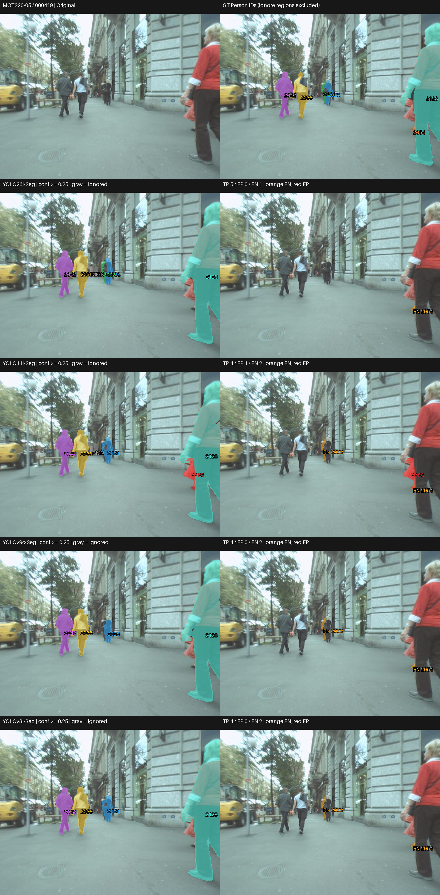
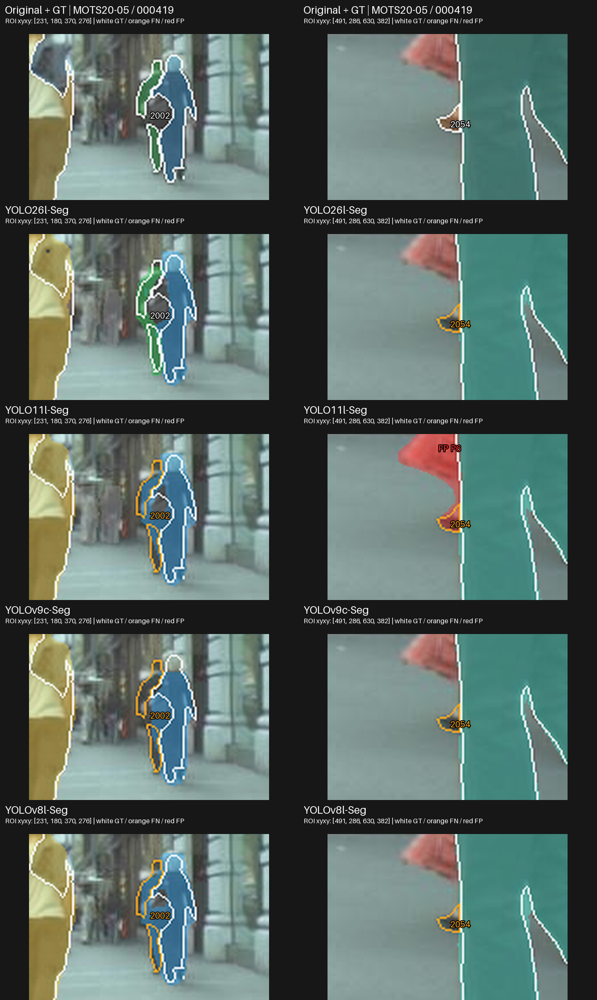
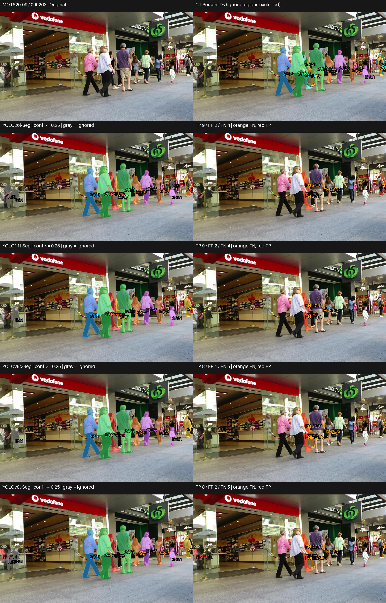
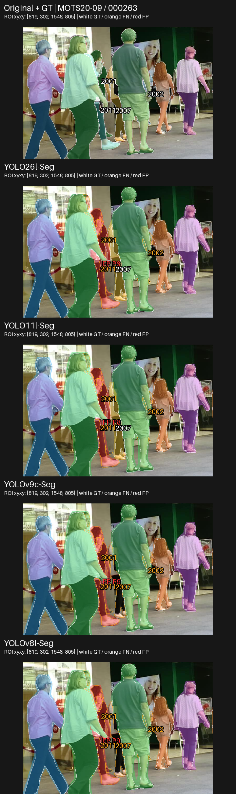
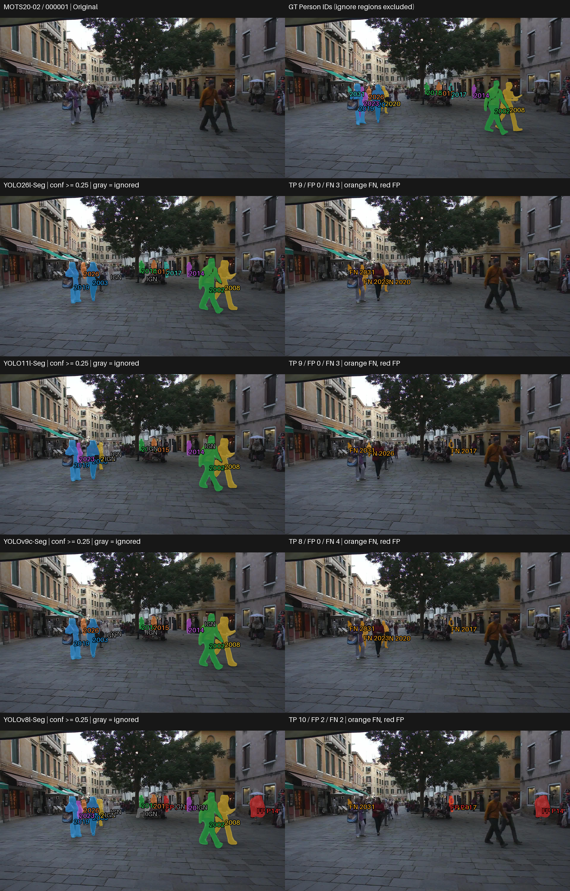
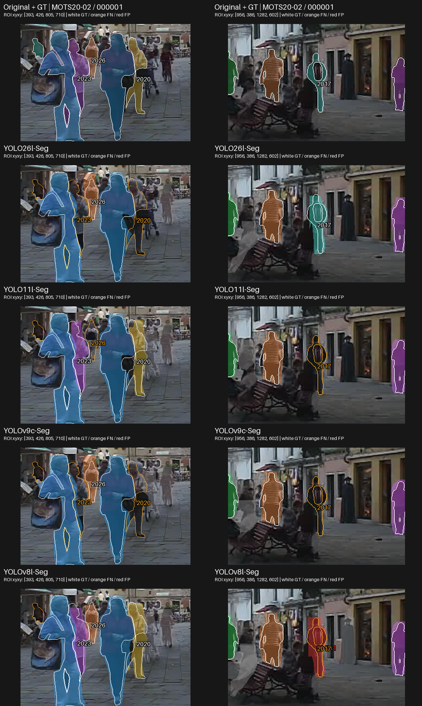
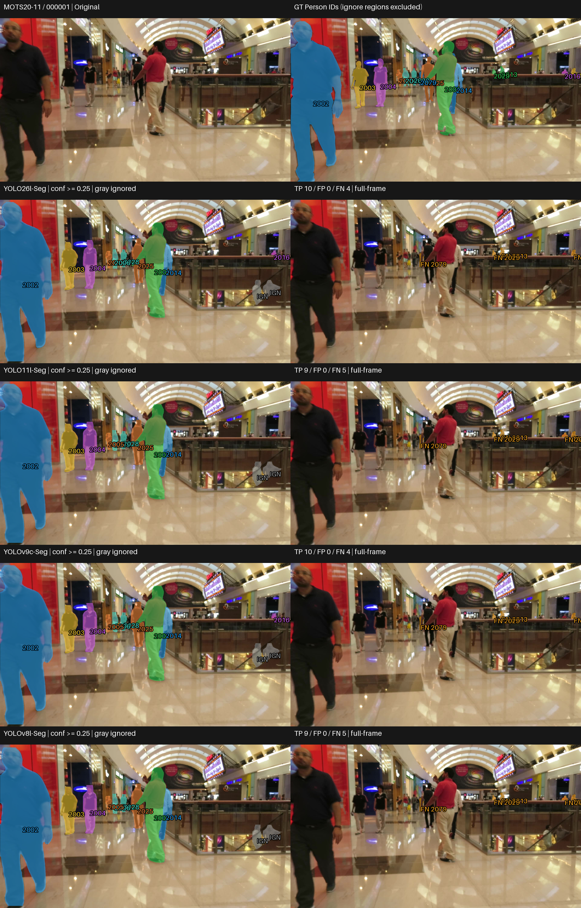
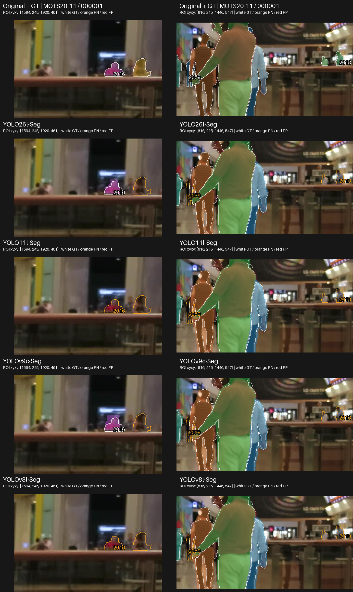

# Second-largest (L/C) — การวิเคราะห์ภาพและพฤติกรรมเชิงคุณภาพ

## 1. ภาพรวมผลการทดลอง

Tier นี้เสร็จครบ 4 โมเดลบน MOTS20 ด้วย โมเดล pretrained โดยไม่ปรับจูน; คงสถานะ PASS WITH WARNINGS
เอกสารนี้อ่านพฤติกรรมจาก prediction จริง ส่วนผลเชิงตัวเลขและข้อแลกเปลี่ยนเต็มอยู่ที่ [RESULTS_SUMMARY_TH.md](RESULTS_SUMMARY_TH.md)

| โมเดล | Mask mAP50-95 | AP75 | Recall |
| --- | --- | --- | --- |
| YOLO26l-Seg | 0.586237 | 0.643537 | 0.834387 |
| YOLO11l-Seg | 0.528228 | 0.565728 | 0.809772 |
| YOLOv9c-Seg | 0.517646 | 0.559180 | 0.802930 |
| YOLOv8l-Seg | 0.520145 | 0.558149 | 0.809400 |

## การเลือกกรณีและการอ่านภาพ

คัด 4 กรณีจาก 12 เฟรมใน manifest ภาพประกอบที่ตรึง โดยอ่านรายเฟรม TP/FP/FN และตรวจต้นฉบับ/GT กับ mask ที่บันทึกไว้ เลือก 1 กรณีร่วม (กรณี 2: MOTS20-09 / 000263) และอีก 3 กรณีวิเคราะห์พฤติกรรมตามพฤติกรรมของขนาดนี้ มีทั้งข้อได้เปรียบข้อผิดพลาดร่วมกรณีสวนอันดับและคะแนนใกล้กัน/ผลคล้ายกันเพื่อลด cherry-picking ไม่ใช่การสุ่มตัวแทนชุดข้อมูล
ภายในแต่ละกรณีต้องใช้เฟรมเดียวกันครบทุกโมเดล ส่วนระหว่างขนาดใช้ภาพร่วมเมื่อมีเหตุผลในการเทียบข้อผิดพลาดเดียวกัน ไม่บังคับใช้ชุดภาพเหมือนกันทั้งหมด แต่ละขนาดมี 4 กรณี; ชุดใหม่รวม 10 เฟรมต้นฉบับต่างกันจากเดิม 6 และเพิ่มฉาก MOTS20-11 ข้อมูลที่ซ้ำข้ามขนาดไม่ใช่ตัวอย่างอิสระเพิ่ม
[CASE_SELECTION.md](outputs/visualizations/qualitative/selection_v2/CASE_SELECTION.md) บันทึกเหตุผลและแหล่งหลักฐาน
ภาพเดิมมี contact sheet แยกโมเดล จึงสร้าง comparison จาก saved RLE ที่ไม่สูญเสียข้อมูลและต้นฉบับ/GT โดยไม่ inference
แถวแรกเป็นต้นฉบับ/GT; แถวถัดมาเรียง YOLO26, YOLO11, YOLOv9, YOLOv8;
ซ้ายเป็น prediction ขวาเป็นภาพซ้อนส่วนที่ไม่มีคู่ทั้งหมดใช้ภาพเต็มเฟรมเดียวกันและสัดส่วนภาพเท่ากัน
สีของ mask ที่จับคู่ได้ผูกกับ GT ID เดียวกัน; สีส้ม FN, สีแดง FP, สีเทา IGN (prediction ที่ถูก ignore)
ใช้ confidence ≥0.25, เกณฑ์จับคู่ mask IoU ≥0.50 และ ignore policy เดิม
FN หมายถึง GT ที่ไม่มีคู่ผ่านเกณฑ์ อาจมาจาก mask ไม่ผ่าน IoU ไม่ใช่ไม่มีการตรวจพบเสมอ;
FP หมายถึง prediction ที่ไม่ จับคู่ valid GT และไม่ถูก ignore จึงไม่จำเป็นต้องเป็นคนที่ไม่มีอยู่จริง
แผงภาพ GTแสดงเฉพาะ Person; IGN ไม่ถูกนับเป็น FP ตัวเลขรายเฟรมตรวจตรงกับ CSV เดิม

### กรณีเหล่านี้ช่วยตัดสินใจอย่างไร

ชุดนี้ใช้ประกอบการเลือกด้านความครบถ้วนของ instance และ prediction ที่ไม่มีคู่โดยอ่านร่วมกับค่าตัวชี้วัดมาตรฐานไม่ได้ให้ผู้ชนะทุกภาพหรือใช้วัดเวลาแฝง/VRAM กรณี 2 เป็นเฟรมร่วมเพื่อเทียบข้อจำกัดบนต้นทางเดียวกัน อีก 3 กรณีเลือกตามพฤติกรรมของขนาด; หากเฟรมข้อมูลเพื่อวิเคราะห์เฉพาะกรณีตรงกับขนาดอื่น เหตุผลต้องอยู่ใน CASE_SELECTION.md และไม่นับเป็นหลักฐานอิสระเพิ่ม 4 กรณีไม่แทน 2,862 เฟรม

| กรณี | ประเด็นปัญหา / บทบาท | ใช้ประกอบการเลือกด้านใด |
| --- | --- | --- |
| 1 | จำแนกโมเดล: GT 2002 เล็กและ FN ของ GT 2054 | เป็นหลักฐานเฉพาะเฟรมที่ YOLO26l เก็บ GT 2002 ได้ แต่อีกสามโมเดลไม่ผ่าน การจับคู่; ใช้ประกอบเมื่อ instance เล็กสำคัญ |
| 2 | ข้อจำกัดร่วม: FN/FP ในกลุ่มคนกลางภาพ | ใช้เห็นข้อจำกัดร่วมก่อนเชื่ออันดับ mAP และตรวจว่าข้อผิดพลาดประเภทนี้ยอมรับได้หรือไม่ |
| 3 | สวนอันดับ / ต่าง GT: TP เท่ากันแต่พลาดคนคนละ ID | ใช้เทียบ YOLO26l/YOLO11l ที่ จำนวน เท่ากันแต่พลาดคนต่างชุด และตรวจคู่ใกล้ YOLOv9c/YOLOv8l ซึ่งมี ข้อแลกเปลี่ยน TP/FP ต่างกัน |
| 4 | nearby-mAP / กรณีสวนอันดับ: GT 2016 พื้นที่เล็กทางขวาหลังราว | ใช้พิจารณาความครบถ้วนของคนพื้นที่เล็ก: YOLO26l/YOLOv9c จับคู่ GT 2016 ได้ ส่วน YOLO11l/YOLOv8l ไม่ผ่าน; YOLOv9c จึงเก็บได้มากกว่า YOLOv8l ในเฟรมนี้ |

ภาพขยายเป็น ROI เพิ่มเติมจากเฟรมต้นฉบับและ mask ที่บันทึกไว้ แถวแรกต้นฉบับ/GT ต่อด้วยโมเดลตามลำดับเดิม แต่ละคอลัมน์ใช้พิกัด/สัดส่วนภาพเดียวกันทุกโมเดล แถวต้นฉบับ/GT ใช้เส้นขาวแสดง valid GT; ในแถวโมเดลเส้นขาวคือ GT ที่ จับคู่ เส้นส้มคือ FN; สีแดงคือ FP สีเทาคือ prediction ที่ถูก ignore พิกัด ROI อยู่บนภาพ ภาพเต็มยังแสดงไว้เพื่อไม่ซ่อนข้อผิดพลาดนอก ROI การขยายไม่เพิ่มรายละเอียดจากต้นฉบับ
ค่าราย GT ด้านล่างเป็นข้อมูลเพื่อวิเคราะห์เฉพาะกรณีของ prediction ที่บันทึกไว้ ที่ confidence ≥0.25: TP ใช้ IoU ของคู่ที่ evaluator จับจริง; FN แสดง IoU สูงสุดของตัวเลือกที่มี ไม่ใช่ AP และไม่เปลี่ยน benchmark ตัวเลข TP/FP/FN ในคำอธิบายเป็นของเต็มเฟรมไม่ใช่จำนวนใน ROI

## กรณี 1 — ความต่างที่ Person ขนาดเล็กกลางภาพ

เหตุผลที่เลือก: ตรวจการเก็บ instance เพิ่มของโมเดลนำด้านความแม่นยำพร้อมเห็นข้อผิดพลาดที่ยังมีร่วมกัน · MOTS20-05 / 000419

### ภาพเปรียบเทียบ

ภาพขยายจุดที่ต้องตรวจ (ใช้คู่กับภาพเต็มด้านบน):

### สิ่งที่เห็นจากภาพ

- YOLO26l เก็บ GT 2002 ซึ่งเป็น Person ขนาดเล็กกลางภาพได้; YOLO11l, YOLOv9c และ YOLOv8l มี FN 2002
- ทั้งสี่โมเดลมี FN 2054 ตรงช่วงขาริมขวา; YOLO11l มี mask แดง FP เพิ่มตรงบริเวณแขน/ถุงของคนใหญ่ริมขวา

ตรวจการจับคู่ราย GT จาก mask ที่บันทึกไว้:

| GT | YOLO26l-Seg | YOLO11l-Seg | YOLOv9c-Seg | YOLOv8l-Seg |
| --- | --- | --- | --- | --- |
| 2002 | TP IoU 0.619 | FN; IoU สูงสุด 0.127 | FN; IoU สูงสุด 0.047 | FN; IoU สูงสุด 0.150 |
| 2054 | FN; IoU สูงสุด 0.000 | FN; IoU สูงสุด 0.076 | FN; IoU สูงสุด 0.000 | FN; IoU สูงสุด 0.000 |

IoU 0.000 คือค่าที่ปัดสามตำแหน่ง ไม่ยืนยันว่าไม่มี prediction; ตัวเลือกอาจมีพื้นที่ทับ GT ต่ำหรือมีคู่กับ GT อื่นแล้ว FN จึงต้องอ่านร่วมกับภาพและเต็มเฟรมการจับคู่

### วิเคราะห์

ความต่างอยู่ที่การแยก instance ขนาดเล็กกลางภาพ ขณะที่คนใหญ่และคู่กลางภาพดูคล้ายกัน การเก็บเพิ่มหนึ่งคนอาจช่วย Recall แต่ FP ริมขวาของ YOLO11 แสดงว่าจำนวน mask มากขึ้นไม่ได้หมายถึงผลดีขึ้นเสมอ FN 2054 มีพื้นที่ GT ที่มองเห็นน้อยตรงขาของคนริมขวา ตัวอย่างนี้ชี้ให้ดูบริเวณเฉพาะ instance แทนตัดสินจากคนใหญ่เพียงอย่างเดียว โดยไม่จัดระดับความรุนแรงของ occlusion

### เชื่อมกับผลเชิงตัวเลข

การเก็บ GT 2002 ของ YOLO26l สอดคล้องในทิศทางกับ Recall รวม 0.834387 ที่สูงกว่า YOLOv8l (0.809400) แต่เฟรมเดียวไม่อธิบายช่องว่าง Recall ทั้งชุดข้อมูล

### ใช้ประกอบการเลือกอย่างไร

**ประเด็นปัญหา / บทบาท:** จำแนกโมเดล — GT 2002 เล็กและ FN ของ GT 2054

**ใช้ประกอบการเลือก:** เป็นหลักฐานเฉพาะเฟรมที่ YOLO26l เก็บ GT 2002 ได้ แต่อีกสามโมเดลไม่ผ่านการจับคู่; ใช้ประกอบเมื่อ instance เล็กสำคัญ

**ขอบเขตหลักฐาน:** ทุกโมเดลยังพลาด GT 2054 และ YOLO11l มี FP เพิ่มริมขวา ไม่ใช้ชนะทุกสภาพภาพ

## กรณี 2 — พลาดร่วมกันในกลุ่มคนซ้อนกัน

เหตุผลที่เลือก: กรณีร่วมของทั้งห้าขนาดเพื่อเทียบข้อผิดพลาดบนเฟรมต้นฉบับเดียวกัน;  แสดงข้อจำกัดร่วมและ FP ของทุกโมเดล แทนเลือกแต่ภาพที่ตัวนำได้เปรียบ · MOTS20-09 / 000263

### ภาพเปรียบเทียบ

ภาพขยายจุดที่ต้องตรวจ (ใช้คู่กับภาพเต็มด้านบน):

### สิ่งที่เห็นจากภาพ

- ทุกโมเดลมี FN ของ GT 2001/2002/2011 ในกลุ่มคนกลางภาพและ 2023 ริมขวา; GT บางส่วนอยู่หลังคนอื่นและมองเห็นเป็นพื้นที่เล็ก
- ทุกโมเดลมี FP แดงบริเวณคนกลางภาพ ถึงแม้หลายคนด้านหน้าจะมี mask ที่จับคู่ได้แล้ว
- YOLO26l และ YOLO11l เก็บได้ 9 instances; YOLOv8l และ YOLOv9c เก็บได้ 8 instances แต่ทั้งหมดก็ยังมี FN หลายตำแหน่ง

ตรวจการจับคู่ราย GT จาก mask ที่บันทึกไว้:

| GT | YOLO26l-Seg | YOLO11l-Seg | YOLOv9c-Seg | YOLOv8l-Seg |
| --- | --- | --- | --- | --- |
| 2001 | FN; IoU สูงสุด 0.243 | FN; IoU สูงสุด 0.253 | FN; IoU สูงสุด 0.252 | FN; IoU สูงสุด 0.236 |
| 2002 | FN; IoU สูงสุด 0.010 | FN; IoU สูงสุด 0.009 | FN; IoU สูงสุด 0.013 | FN; IoU สูงสุด 0.010 |
| 2007 | TP IoU 0.631 | TP IoU 0.557 | FN; IoU สูงสุด 0.050 | FN; IoU สูงสุด 0.052 |
| 2011 | FN; IoU สูงสุด 0.366 | FN; IoU สูงสุด 0.373 | FN; IoU สูงสุด 0.387 | FN; IoU สูงสุด 0.368 |

IoU 0.000 คือค่าที่ปัดสามตำแหน่ง ไม่ยืนยันว่าไม่มี prediction; ตัวเลือกอาจมีพื้นที่ทับ GT ต่ำหรือมีคู่กับ GT อื่นแล้ว FN จึงต้องอ่านร่วมกับภาพและเต็มเฟรมการจับคู่

### วิเคราะห์

ส่วนที่พลาดไม่ได้มีเฉพาะคนไกล แต่รวมพื้นที่ GT เล็กในกลุ่มคนที่ซ้อนกันด้วย FP บาง mask อยู่บนคนจริงที่ไม่ จับคู่ ตามเกณฑ์ จึงควรอ่านว่า segmentation/ข้อผิดพลาดจากการจับคู่ก่อนเรียกว่า hallucinated person จำนวนคนที่เก็บได้เพิ่มยังเกิดพร้อม FP ได้ ภาพนี้ไม่พิสูจน์สาเหตุของข้อผิดพลาดหรือความทนทานต่อ occlusion ของทั้งชุดข้อมูล

### เชื่อมกับผลเชิงตัวเลข

แม้ YOLO26l มี mAP/AP75 รวมสูงสุด ก็ยังเกิด FN และ FP ในกรณีนี้; ภาพช่วยเห็นข้อจำกัดที่คะแนนเฉลี่ยไม่แสดง การสรุปจำนวน FN/FP ทั้งชุดข้อมูลต้องอ่าน CSV มาตรฐานไม่คูณจากกรณีนี้

### ใช้ประกอบการเลือกอย่างไร

**ประเด็นปัญหา / บทบาท:** ข้อจำกัดร่วม — FN/FP ในกลุ่มคนกลางภาพ

**ใช้ประกอบการเลือก:** ใช้เห็นข้อจำกัดร่วมก่อนเชื่ออันดับ mAP และตรวจว่าข้อผิดพลาดประเภทนี้ยอมรับได้หรือไม่

**ขอบเขตหลักฐาน:** TP มากกว่าไม่ได้แปลว่าไม่มี FP หรือว่า segmentation ของทุกคนดีกว่า

## กรณี 3 — กรณีสวนอันดับและ ข้อแลกเปลี่ยน ของ การตรวจพบ

เหตุผลที่เลือก: รวมตัวอย่างที่โมเดลนำด้านความแม่นยำไม่ได้เก็บ Person มากที่สุด · MOTS20-02 / 000001

### ภาพเปรียบเทียบ

ภาพขยายจุดที่ต้องตรวจ (ใช้คู่กับภาพเต็มด้านบน):

### สิ่งที่เห็นจากภาพ

- YOLOv8l จับคู่ ได้ 10 instances มากกว่า YOLO26l/YOLO11l ที่ได้ 9 และ YOLOv9c ที่ได้ 8 แต่มี FP 2 masks กลางฉากและบริเวณวัตถุใต้ร่มริมขวา
- YOLO26l และ YOLO11l มี FN เท่ากัน 3 แต่คนที่พลาดต่างกัน: YOLO26l พลาด 2020/2023 ในกลุ่มซ้าย ขณะที่ YOLO11l พลาด 2026 ทางซ้ายและ 2017 กลางภาพ; ทั้งคู่พลาด 2031

ตรวจการจับคู่ราย GT จาก mask ที่บันทึกไว้:

| GT | YOLO26l-Seg | YOLO11l-Seg | YOLOv9c-Seg | YOLOv8l-Seg |
| --- | --- | --- | --- | --- |
| 2017 | TP IoU 0.502 | FN; IoU สูงสุด 0.000 | FN; IoU สูงสุด 0.000 | FN; IoU สูงสุด 0.495 |
| 2020 | FN; IoU สูงสุด 0.021 | TP IoU 0.552 | FN; IoU สูงสุด 0.047 | TP IoU 0.599 |
| 2023 | FN; IoU สูงสุด 0.067 | TP IoU 0.647 | FN; IoU สูงสุด 0.086 | TP IoU 0.650 |
| 2026 | TP IoU 0.640 | FN; IoU สูงสุด 0.000 | TP IoU 0.582 | TP IoU 0.706 |

IoU 0.000 คือค่าที่ปัดสามตำแหน่ง ไม่ยืนยันว่าไม่มี prediction; ตัวเลือกอาจมีพื้นที่ทับ GT ต่ำหรือมีคู่กับ GT อื่นแล้ว FN จึงต้องอ่านร่วมกับภาพและเต็มเฟรมการจับคู่

### วิเคราะห์

YOLOv8l เก็บได้มากกว่าแต่แลกกับ FP; YOLO26l/YOLO11l มี TP/FP/FN เท่ากันแต่พลาดคนคนละตำแหน่ง สรุปคุณภาพจากจำนวนรวมเพียงอย่างเดียวจึงซ่อนความต่างของข้อผิดพลาด behavior ไม่มีการเปลี่ยน confidence ให้โมเดลใดเป็นพิเศษและบริเวณ FP ริมขวายังคงแสดงเต็มภาพ ไม่ crop เพื่อซ่อนข้อผิดพลาด

### เชื่อมกับผลเชิงตัวเลข

YOLO26l มี Recall รวมสูงสุด 0.834387 แต่ไม่ได้มี TP สูงสุดทุกเฟรม; AP75 ใช้ mask IoU 0.75 และการเรียง confidence จึงไม่แทนด้วย TP ที่ IoU 0.50 ของเฟรมนี้ ความต่างของ matched-mask IoU ใช้เฉพาะคู่ที่ผ่านการจับคู่และไม่รวมคนที่พลาด

### ใช้ประกอบการเลือกอย่างไร

**ประเด็นปัญหา / บทบาท:** สวนอันดับ / ต่าง GT — TP เท่ากันแต่พลาดคนคนละ ID

**ใช้ประกอบการเลือก:** ใช้เทียบ YOLO26l/YOLO11l ที่จำนวนเท่ากันแต่พลาดคนต่างชุดและตรวจคู่ใกล้ YOLOv9c/YOLOv8l ซึ่งมีข้อแลกเปลี่ยน TP/FP ต่างกัน

**ขอบเขตหลักฐาน:** GT 2017 มี prediction ของ YOLOv8l ที่ใกล้เกณฑ์การจับคู่; ไม่ควรอ่าน FN ว่าไม่มีการตรวจพบทุกครั้ง

## กรณี 4 — คนหลังราวที่คู่ mAP ใกล้กันเก็บได้ต่างกัน

เหตุผลที่เลือก: ตรวจคู่ YOLOv9c/YOLOv8l ในฉากที่ไม่ได้ปรากฏในชุดเดิมและมีข้อผิดพลาดร่วมไว้เทียบ · MOTS20-11 / 000001

### ภาพเปรียบเทียบ

ภาพขยายจุดที่ต้องตรวจ (ใช้คู่กับภาพเต็มด้านบน):

### สิ่งที่เห็นจากภาพ

- GT 2016 เป็นพื้นที่ Person เล็กที่มองเห็นเหนือราวด้านขวา; YOLO26l/YOLOv9c จับคู่ ได้ แต่ YOLO11l/YOLOv8l มี FN
- ทุกโมเดลมี FN ของ GT 2013/2015/2029 หลังราวและ GT 2079 ด้านหลังคนกลางภาพ; ROI ขวาแสดง 2013/2079 ที่ยังไม่ผ่านการจับคู่
- YOLO26l/YOLO11l/YOLOv9c/YOLOv8l มี TP 10/9/10/9 และ FN 4/5/4/5; ไม่มี FP ในทั้งสี่โมเดล คนใหญ่ด้านหน้าถูกเก็บในหลายโมเดล

ตรวจการจับคู่ราย GT จาก mask ที่บันทึกไว้:

| GT | YOLO26l-Seg | YOLO11l-Seg | YOLOv9c-Seg | YOLOv8l-Seg |
| --- | --- | --- | --- | --- |
| 2013 | FN; IoU สูงสุด 0.000 | FN; IoU สูงสุด 0.000 | FN; IoU สูงสุด 0.000 | FN; IoU สูงสุด 0.000 |
| 2016 | TP IoU 0.665 | FN; IoU สูงสุด 0.000 | TP IoU 0.559 | FN; IoU สูงสุด 0.000 |
| 2079 | FN; IoU สูงสุด 0.005 | FN; IoU สูงสุด 0.009 | FN; IoU สูงสุด 0.012 | FN; IoU สูงสุด 0.012 |

IoU ที่ปัดเป็น 0.000 ไม่ยืนยันว่าไม่มี prediction; FN หมายถึงไม่มีคู่ผ่าน evaluator ตาม policy เดิม

### วิเคราะห์

คนใหญ่ในภาพเต็มทำให้ผลดูใกล้กัน แต่ ROI ที่ราวแสดง ความต่างระดับ instance ซึ่งเปลี่ยนความครบถ้วนได้จริง GT 2016 ของ YOLOv9c มี matched IoU 0.559 เทียบกับ YOLO26l 0.665; เป็นการเทียบคนเดียวกัน ไม่ใช่ค่าเฉลี่ยของคนคนละชุด อีก ROI แสดงข้อจำกัดร่วมเพื่อไม่ให้กรณีนี้ถูกอ่านเป็นชัยชนะต่อทุกคนตัวเล็ก

### เชื่อมกับผลเชิงตัวเลข

YOLOv9c/YOLOv8l มี mAP 0.517646/0.520145 ค่อนข้างใกล้กัน แม้ YOLOv8l มี Recall รวมสูงกว่าเฟรมนี้ YOLOv9c กลับ จับคู่ มากกว่าหนึ่ง GT กรณีนี้ร่วมกับกรณี 3 จึงแสดงข้อผิดพลาดข้อแลกเปลี่ยนคนละทิศทาง ไม่ใช่หลักฐานว่าคู่ใดเหนือกว่าทุกเฟรม

### ใช้ประกอบการเลือกอย่างไร

**ประเด็นปัญหา / บทบาท:** nearby-mAP / กรณีสวนอันดับ — GT 2016 พื้นที่เล็กทางขวาหลังราว

**ใช้ประกอบการเลือก:** ใช้พิจารณาความครบถ้วนของคนพื้นที่เล็ก: YOLO26l/YOLOv9c จับคู่ GT 2016 ได้ ส่วน YOLO11l/YOLOv8l ไม่ผ่าน; YOLOv9c จึงเก็บได้มากกว่า YOLOv8l ในเฟรมนี้

**ขอบเขตหลักฐาน:** Recall รวมของ YOLOv9c ต่ำกว่า YOLOv8l แม้เฟรมนี้มี TP มากกว่า; ไม่จัดอันดับชุดข้อมูลใหม่จาก GT เดียวและทุกโมเดลยังมี FN ร่วม

## วิเคราะห์ข้อผิดพลาด

| รูปแบบข้อผิดพลาด | โมเดลที่พบ | กรณีที่พบ | การตีความ |
| --- | --- | --- | --- |
| Person พื้นที่เล็กไม่มีคู่ผ่านเกณฑ์ | ทุกโมเดล (2054); YOLO11l/YOLOv9c/YOLOv8l (2002) | กรณี 1 | ข้อผิดพลาดต่าง GT ต้องดู ความครบถ้วน ร่วมกับ การจับคู่ |
| GT ที่ไม่มีคู่ ในกลุ่มคน | ทุกโมเดล | กรณี 2 | ข้อจำกัดร่วม ไม่อนุมานความถี่หรือสาเหตุ |
| คนพื้นที่เล็กหลังราวไม่ผ่าน การจับคู่ | YOLO11l/YOLOv8l (2016); ทุกโมเดล (2013/2079) | กรณี 4 | ความต่างของ GT 2016 ไม่ชดเชย FN ร่วมทั้งหมด |
| Unmatched ผลลัพธ์ / mask ส่วนเกิน | ทุกโมเดลใน กรณี 2; YOLOv8l ใน กรณี 3 | กรณี 2/3 | พิจารณา TP/FP ร่วมกัน; ไม่ใช่คนที่ไม่มีจริงโดยอัตโนมัติ |

เป็นประเภทข้อผิดพลาดที่พบในกรณีที่เลือก ไม่ใช่อัตราหรือความถี่ทั้งชุดข้อมูลไม่ระบุ การรวมหลาย instance/mask แตกเป็นส่วน/mask ล้ำออกนอกขอบ หากไม่มีหลักฐานพอ

## ตรวจภาพของคู่ที่คะแนนใกล้กัน

YOLOv9c/YOLOv8l มี mAP 0.517646/0.520145 ค่อนข้างใกล้กันกรณี 3 YOLOv8l เก็บได้มากกว่าแต่มี FP เพิ่ม ขณะที่กรณี 4 YOLOv9c เก็บ GT 2016 เพิ่มได้โดยไม่มี FP ทั้งคู่ภาพจึงแสดงข้อผิดพลาดข้อแลกเปลี่ยนคนละทิศทาง แม้ Recall รวมของ YOLOv8l สูงกว่า ไม่มีฐานให้ประกาศความเหนือกว่าทุกเฟรมหรือ statistical superiority; inference YOLOv9c/YOLO11l ต่าง 0.094 ms ตาม benchmark ซึ่งภาพใช้ยืนยันไม่ได้

## สิ่งที่เรียนรู้จากภาพจริง

### ข้อสังเกต 1

กรณี 1 คนใหญ่ถูกเก็บในทุกโมเดล แต่ GT 2002 เป็นจุดที่ผลต่างกัน

**การตีความ:** การดูเฉพาะ Person ใหญ่ด้านหน้าอาจซ่อนข้อผิดพลาดระดับ instance; ต้องตรวจ GT ของคนเล็กด้วย ไม่ใช่ข้อสรุปความทนทานทุกสัดส่วนภาพ

### ข้อสังเกต 2

กรณี 2 ทุกโมเดลพลาด GT ในกลุ่มคนกลางภาพและมี prediction ที่ไม่มีคู่บนคนจริง

**การตีความ:** การแบ่ง instance และการผ่าน mask IoU เป็นคนละเรื่องกับแค่เห็นว่ามีคน; FP/FN จึงควรอ่านคู่กับ GT และ ignore policy

### ข้อสังเกต 3

กรณี 3 มีโมเดลอื่นเก็บ valid Person มากกว่าโมเดลนำด้านความแม่นยำและ YOLO26/YOLO11 พลาดคนคนละชุด

**การตีความ:** อันดับรวมไม่ใช่คำรับรองทุกเฟรม; คะแนนหรือจำนวนที่ใกล้กันอาจเกิดจากข้อผิดพลาดต่างตำแหน่ง

### ข้อสังเกต 4

กรณี 4 YOLO26l/YOLOv9c จับคู่ GT 2016 ได้ แต่ YOLO11l/YOLOv8l พลาด; ทุกโมเดลยังพลาด 2013/2079

**การตีความ:** กรณีนี้แยกพฤติกรรมราย GT ของคู่คะแนนใกล้และเป็นข้อยกเว้นต่ออันดับ Recall รวม ไม่ใช่ผู้ชนะทุกคนพื้นที่เล็ก

## เมื่อดูทั้งตัวเลขและภาพร่วมกัน

YOLO26l นำ mAP/AP75/Recall รวม ส่วนภาพช่วยตรวจว่าความต่างอยู่ที่ GT ใดและมีผลลัพธ์เพิ่มแบบไหนกรณี 1 แสดง instance ที่เก็บเพิ่ม แต่กรณี 2 ยังมีข้อผิดพลาดร่วมและกรณี 3 เป็นกรณีสวนอันดับความครบถ้วนกรณี 4 แยก GT 2016 ของคู่ mAP ใกล้กัน พร้อมข้อจำกัดร่วม จึงไม่ใช้ภาพใดภาพหนึ่งอธิบายคะแนนทั้งชุดข้อมูล AP75 รวม การเรียง confidence และเกณฑ์ IoU ที่เข้มกว่า ซึ่งภาพที่ confidence 0.25/การจับคู่ 0.50 แสดงไม่ครบ; TP-only quality อาจใช้ GT คนละชุด

เวลาแฝงและ VRAM เป็นการวัดระดับระบบอ่านจาก benchmark แยกจากภาพ segmentation ไม่สามารถอนุมานสาเหตุหรือวัดสองค่านี้จาก mask

## ถ้าพิจารณาทั้งผลเชิงตัวเลขและภาพ

| สิ่งที่ให้ความสำคัญ | โมเดลที่พิจารณา | หลักฐาน |
| --- | --- | --- |
| ความแม่นยำ | YOLO26l-Seg | mAP/AP75/Recall รวมสูงสุด; กรณี 1 แสดง GT ที่เก็บเพิ่ม; กรณี 2/3/4 ช่วยตรวจข้อจำกัดและ ข้อผิดพลาด ข้อแลกเปลี่ยน |
| ความเร็ว | YOLOv9c-Seg (inference); YOLO26l-Seg (pipeline) | Clean timing benchmark; ภาพไม่วัดเวลา |
| VRAM ต่ำ | YOLO26l-Seg | การวัด peak allocated VRAM; ภาพไม่วัด หน่วยความจำ |
| ข้อแลกเปลี่ยนโดยรวม | YOLO26l-Seg หากยอมรับ inference 36.266 ms | Accuracy/pipeline/VRAM นำพร้อมกัน แต่ inference ไม่เร็วสุด; กรณี 3 ยังมีโมเดลเก็บคนได้มากกว่า |

เป็นตัวเลือกสำหรับข้ามขนาดและการประเมินความทนทานต่อ CCTV ภายหลัง ไม่มีคะแนนรวมถ่วงน้ำหนักหรือข้อยืนยัน ความเหนือกว่าสำหรับ CCTV ขั้นสุดท้าย

## ข้อจำกัด

- เฟรมที่เลือกเป็นตัวอย่างเชิงคุณภาพจาก 12 เฟรมเดิม ไม่แทนตัวชี้วัดระดับชุดข้อมูลและไม่ใช่ตัวอย่างที่เป็นตัวแทนชุดข้อมูล
- มีทั้งข้อได้เปรียบข้อผิดพลาดกรณีสวนอันดับและผลคล้ายกันเพื่อลด cherry-picking; ยังอาจพลาดข้อผิดพลาดชนิดอื่นนอก selection pool
- MOTS20 ไม่ใช่ผลทดสอบความทนทานต่อ CCTV ขั้นสุดท้าย; ไม่อนุมานภาพพร่า/แสงน้อย/มุมกล้องหรือระดับ occlusion
- Qualitative observations และ numerical near ties ไม่ใช่นัยสำคัญทางสถิติ
- ภาพย่อ/overlay อาจบังรายละเอียดขอบ; ตรวจ saved RLE หากต้องการตรวจพิกเซล ไม่อธิบายสาเหตุจากโครงสร้างโมเดล

## รายละเอียดเต็ม

[บทสรุปเชิงตัวเลข](RESULTS_SUMMARY_TH.md) · [REPORT.md](REPORT.md) · [TIER_RESULTS.csv](metrics/TIER_RESULTS.csv) ·
[หลักฐานรายกรณี](outputs/visualizations/qualitative/selection_v2/CASE_EVIDENCE.json) ·
[การศึกษาหลัก](https://github.com/folklazy/YOLO_Instance_Segmentation_MOTS20_Scaling_Study)
