# Experiment 2: Second-largest available variant comparison

Run `benchmark-20261001T0352Z` — **PASS WITH WARNINGS**

## 1. ทดสอบอะไร

เปรียบเทียบ YOLO26l-Seg, YOLO11l-Seg, YOLOv8l-Seg และ YOLOv9c-Seg บน Person instance segmentation ของ MOTS20 train ทั้ง 2,862 ภาพ (26,894 GT instances) ไม่มีการฝึกเพิ่ม โมเดลเป็นรุ่นใหญ่เป็นอันดับสองที่มีให้ใช้ในแต่ละตระกูล YOLOv9 ใช้ c ไม่ใช่ L และทั้งสี่รุ่นมี capacity ไม่เท่ากัน

## 2. เงื่อนไขการทดลอง

ใช้ Tesla T4, CUDA:0, FP32, batch=1 และ input 1×3×640×640 เหมือนกันทุกโมเดล ไม่ใช้ augmentation ใช้ native masks, square letterbox และ YOLO26 one-to-many NMS ตาม Experiment 1 ทุกภาพและ GT ผ่านการตรวจ hashes ว่าตรงกัน ใช้ภาพ preflight/timing/visualization เดิม evaluator เดิม confidence floor=0.001, fixed threshold=0.25, NMS IoU=0.70 และ evaluation mask IoU=0.50 คง AP maxDet=200 หลังผ่าน convergence test วัด timing แยก 100 ภาพ × 3 รอบหลัง warmup 10 ครั้งต่อรอบ

## 3. ผลหลัก

**Accuracy สูงสุด: YOLO26l-Seg (mAP50-95=0.586237)**
**Inference เร็วสุด: YOLOv9c-Seg (35.293 ms)**
**Pipeline เร็วสุด: YOLO26l-Seg (76.403 ms; 13.09 FPS)**
**Peak allocated VRAM ต่ำสุด: YOLO26l-Seg (777.52 MiB)**

ความแม่นยำ ความเร็ว และหน่วยความจำเป็นคนละเป้าหมาย ให้เลือกตามข้อจำกัดงาน ไม่รวมเป็นคะแนนถ่วงน้ำหนัก ชุด Pareto สำหรับ mAP–inference คือ YOLO26l-Seg, YOLO11l-Seg, YOLOv9c-Seg

**ถ้าเลือกจุดเริ่มต้นที่สมดุลสำหรับเงื่อนไขนี้ ให้ดู YOLO26l ก่อน**: มี accuracy สูงสุด พร้อม pipeline mean และ allocated VRAM ต่ำสุด แต่ forward ช้ากว่า YOLOv9c ประมาณ 0.973 ms ส่วน YOLOv9c ชนะ YOLO11l ด้าน forward เพียง 0.094 ms (ประมาณ 0.27%) และ pipeline ของ YOLO26l/YOLO11l/YOLOv9c ห่างกันไม่ถึง 0.52 ms จึงควรอ่านเป็นค่าที่วัดได้ใกล้กัน ไม่ใช่ความเหนือกว่าทางสถิติ

13.09 FPS ของ YOLO26l เป็น **pipeline FPS ตามนิยามนี้** ไม่รวม RLE preparation ซึ่งวัดแยกได้เฉลี่ย 230.06 ms/ภาพ และไม่รวม disk I/O จึงไม่ใช่ FPS ของระบบบันทึก masks หรือ CCTV end-to-end

## 4. แต่ละโมเดลเด่นด้านไหน

- **YOLO26l-Seg**: mAP 0.586237, recall 0.8344, inference 36.266 ms, pipeline 76.403 ms (13.09 FPS), peak VRAM 777.52 MiB
- **YOLO11l-Seg**: mAP 0.528228, recall 0.8098, inference 35.387 ms, pipeline 76.810 ms (13.02 FPS), peak VRAM 794.47 MiB
- **YOLOv9c-Seg**: mAP 0.517646, recall 0.8029, inference 35.293 ms, pipeline 76.921 ms (13.00 FPS), peak VRAM 838.49 MiB
- **YOLOv8l-Seg**: mAP 0.520145, recall 0.8094, inference 40.090 ms, pipeline 83.558 ms (11.97 FPS), peak VRAM 855.27 MiB

YOLO26l เป็นตัวเด่นด้าน accuracy และทรัพยากรที่วัดในชุดนี้; YOLO11l เป็นทางเลือกที่ forward ใกล้ YOLOv9c แต่มี mAP สูงกว่า 1.058 percentage points; YOLOv9c มี forward mean ต่ำสุดแต่ mAP ต่ำสุดใน tier นี้; YOLOv8l เสีย accuracy จากรุ่นใหญ่ของตนเองน้อยที่สุด แต่ใน tier นี้ยังมีทั้ง latency และ VRAM สูงกว่า YOLO26l จึงไม่อยู่บน accuracy–inference Pareto frontier

## 5. เทียบกับรุ่นใหญ่สุดที่ทดสอบก่อนหน้า

- **YOLO26x-Seg → YOLO26l-Seg**: mAP 0.603730 → 0.586237 (Δ -1.749 percentage points); inference 72.458 → 36.266 ms (Δ -49.95%); peak VRAM 952.18 → 777.52 MiB (Δ -18.34%)
- **YOLO11x-Seg → YOLO11l-Seg**: mAP 0.536674 → 0.528228 (Δ -0.845 percentage points); inference 69.406 → 35.387 ms (Δ -49.01%); peak VRAM 942.48 → 794.47 MiB (Δ -15.70%)
- **YOLOv8x-Seg → YOLOv8l-Seg**: mAP 0.524758 → 0.520145 (Δ -0.461 percentage points); inference 67.843 → 40.090 ms (Δ -40.91%); peak VRAM 1001.13 → 855.27 MiB (Δ -14.57%)
- **YOLOv9e-Seg → YOLOv9c-Seg**: mAP 0.536642 → 0.517646 (Δ -1.900 percentage points); inference 65.888 → 35.293 ms (Δ -46.43%); peak VRAM 855.41 → 838.49 MiB (Δ -1.98%)

Δ หมายถึง second-largest ลบ largest: ค่า latency/VRAM ติดลบคือใช้ลดลง ค่าความแม่นยำติดลบคือเสีย accuracy ใช้ผล Experiment 1 ที่เก็บไว้ ไม่รัน inference เดิมซ้ำ ตาราง technical ด้านล่างแสดง AP50/AP75/Recall/F1, pipeline, FPS, parameters และขนาด checkpoint เพิ่มเติม

ผลวัดแสดงว่า inference เร็วขึ้นจริงทุกตระกูลประมาณ 40.91–49.95% และ pipeline latency ลด 23.65–30.31% โดย mAP ลด 0.461–1.900 percentage points การลด parameters ไม่ได้แปลว่า VRAM ลดในสัดส่วนเดียวกัน: v9e→v9c ลด parameters 53.90% แต่ peak allocated ลดเพียง 16.92 MiB (1.98%); peak **reserved** กลับเพิ่มจาก 1,938 เป็น 2,682 MiB (+744 MiB, +38.39%) เพราะเป็นคนละตัวชี้วัดกับ allocated

อันดับ accuracy เปลี่ยนจาก 26x > 11x > v9e > v8x เป็น 26l > 11l > v8l > v9c โดย v8l กับ v9c ต่างเพียง 0.250 percentage points ไม่อ้าง statistical significance อีกข้อสังเกตคือ YOLO26l ยังมี mAP สูงกว่ารุ่นใหญ่สุดของอีกสามตระกูลใน Experiment 1 แต่ไม่ได้พิสูจน์ architecture superiority เพราะ capacity และ pretraining ไม่ถูกควบคุมให้เท่ากัน

## 6. ข้อจำกัด

โมเดลมี capacity และสูตร pretraining ต่างกัน ภาพวิดีโอต่อเนื่องมีความสัมพันธ์กัน จึงไม่อ้าง statistical significance ค่า IoU/Dice เป็นเฉพาะ TP ที่จับคู่สำเร็จ ต้องอ่านพร้อม recall ผล MOTS20 ไม่ใช่หลักฐาน final CCTV robustness และ crowd count ไม่ใช่ระดับ occlusion ที่ติดป้ายกำกับ Shared-GPU telemetry ลดความเสี่ยงการปนเปื้อนแต่ไม่รับประกันว่าไม่มีผลระบบชั่วขณะ

## 7. ทำอะไรต่อ

ทดลอง YOLO บนชุด CCTV ที่มี GT แยกเงื่อนไข blur, low-light และ camera angle โดยกำหนด protocol ก่อนเห็นผล หากต้องการพิสูจน์ความเหนือกว่าของ architecture ต้องมี capacity-controlled comparison เพิ่มต่างหาก

## 1. Research question
How do the second-largest available official pretrained segmentation checkpoints from
four YOLO generations generalize to MOTS20 Person masks under a common protocol?
No training, fine-tuning, transfer learning or adaptation was performed.

## 2. Experimental protocol
See [EXPERIMENT_PROTOCOL.md](EXPERIMENT_PROTOCOL.md). Config hash:
`95b64f1ba3d900625add7d515421b75b9b8a8788aef44582e4e4da20082ee5f2`. Protocol hash: `4552a44160fa66ac058756ed55d8b25d750429b52aa529e9441710dfffdd5a45`.
Inference runs sequentially on CUDA:0. Native-resolution masks use retina_masks;
all actual network tensors are 1×3×640×640. Aspect-preserving centered letterbox
has value-114 padding, RGB FP32 /255. Input is 1920×1080→640×360 plus 140 pixels
top/bottom, or 640×480→640×480 plus 80 pixels top/bottom. NMS is box IoU 0.70;
evaluation matches mask IoU 0.50. These are separate operations.

Valid Person GT is matched first; unmatched predictions are ignored when their
intersection with the union of class-10 masks / prediction area ≥0.50. Fixed
metrics use ≥0.25; AP uses saved NMS candidates >0.001 and common maxDet
200. AP is pooled confidence-ranked frame-level Person mask AP,
not official MOTS tracking evaluation. Matched Dice=2IoU/(1+IoU).

## 3. Dataset description
Only bundled MOTS train GT is used. No test GT, duplicate MOTSLabels, dataset
adaptation, file modification or split creation. All frames and GT RLE decoded;
all image/GT/checkpoint hashes rechecked at completion.
| Sequence | Frames | Resolution W×H | GT Person instances | Ignore regions |
| --- | --- | --- | --- | --- |
| MOTS20-02 | 600 | [1920, 1080] | 7039 | 600 |
| MOTS20-05 | 837 | [640, 480] | 6570 | 802 |
| MOTS20-09 | 525 | [1920, 1080] | 4774 | 525 |
| MOTS20-11 | 900 | [1920, 1080] | 8511 | 900 |

## 4. Model/checkpoint table

| Model | Loaded parameters | Local NMS GFLOPs @640 | Checkpoint MB (decimal) | SHA256 |
| --- | --- | --- | --- | --- |
| YOLO26l-Seg | 31515528 | 151.303987 | 63.700037 | 636024306410afa1732692322fba57d22ea2b1c2f07613fcee131a93d7dd380c |
| YOLO11l-Seg | 27678368 | 133.176166 | 56.096965 | cabe90049795dfc9a370b7934d6dec7f6b9e44a20e573b0ff81b7e205512c872 |
| YOLOv8l-Seg | 45997728 | 211.059763 | 92.417004 | ca3ec94c445aeaf79c2b57982fb451060f18a7561e2c20b4d26bb9dc1fcabf93 |
| YOLOv9c-Seg | 27897120 | 149.339597 | 56.470235 | 73c2ac85148fa6fa560ef9933f8931e40d0dbc8f8c7c0a6d165145b6e5713565 |

Sources: official Ultralytics assets v8.4.0; exact URLs and full COCO class mapping in checkpoint_manifest.json. Every checkpoint has task=segment and names[0]=person.

## 5. Environment
Hostname `ai-dev-server`; OS `Linux-6.8.0-139-generic-x86_64-with-glibc2.39`; Python 3.12.3;
Ultralytics 8.4.160; PyTorch 2.14.0+cu130;
torchvision 0.29.0+cu130; NumPy 2.5.3;
pycocotools 2.0.11; CUDA runtime 13.0.
Tesla T4, NVIDIA driver 580.178.04, physical VRAM 15,360 MiB;
CUDA-visible device memory approximately 14,911 MiB. CUDA_VISIBLE_DEVICES=None.
No packages changed. Git status/commit unavailable if workspace is not a Git checkout;
captured command return codes and errors are preserved in environment.json.

The unchanged environment has no `pip` module. The complete installed-package
inventory is recorded using `importlib.metadata` in `manifests/package_inventory.json`.
The publishable environment record is `manifests/environment_public.json`; the
original environment record remains local with its SHA256 preserved. Experiment 2
uses the inherited `clean_repetition/` directory name for its first and only timing
pass: all 12 runs were clean, so no Experiment 2 timing pass was discarded.

## 6. Preflight/maxDet validation
25 evenly spaced frames from each sequence, frozen before predictions. All four
models completed the same 100 frames. Strict convergence tolerance is <0.0001
for each AP metric relative to cap 1000. Chosen common cap: **200**.
| Model | maxDet | AP50 | AP75 | mAP50-95 | Converged |
| --- | --- | --- | --- | --- | --- |
| yolo26l-seg.pt | 100 | 0.8794740631991724 | 0.6366989717421137 | 0.5722119624027698 | False |
| yolo26l-seg.pt | 200 | 0.8816242782206746 | 0.6366989717421137 | 0.572530606005279 | True |
| yolo26l-seg.pt | 300 | 0.8816242782206746 | 0.6366989717421137 | 0.572530606005279 | True |
| yolo26l-seg.pt | 1000 | 0.8816242782206746 | 0.6366989717421137 | 0.572530606005279 | True |
| yolo11l-seg.pt | 100 | 0.8582933442890912 | 0.5478371702660657 | 0.5173433664810232 | False |
| yolo11l-seg.pt | 200 | 0.85824316689699 | 0.5478193929468251 | 0.5174813604399083 | True |
| yolo11l-seg.pt | 300 | 0.85824316689699 | 0.5478193929468251 | 0.5174813604399083 | True |
| yolo11l-seg.pt | 1000 | 0.85824316689699 | 0.5478193929468251 | 0.5174813604399083 | True |
| yolov8l-seg.pt | 100 | 0.8559594345205586 | 0.5265311711001056 | 0.5083070300867604 | False |
| yolov8l-seg.pt | 200 | 0.8559568275605922 | 0.5265238124754219 | 0.5084936555577095 | True |
| yolov8l-seg.pt | 300 | 0.8559568275605922 | 0.5265238124754219 | 0.5084936555577095 | True |
| yolov8l-seg.pt | 1000 | 0.8559568275605922 | 0.5265238124754219 | 0.5084936555577095 | True |
| yolov9c-seg.pt | 100 | 0.8490950289560034 | 0.5293382889372923 | 0.5034988270213417 | False |
| yolov9c-seg.pt | 200 | 0.849323464161515 | 0.5293382889372923 | 0.5038150628013008 | True |
| yolov9c-seg.pt | 300 | 0.849323464161515 | 0.5293382889372923 | 0.5038150628013008 | True |
| yolov9c-seg.pt | 1000 | 0.849323464161515 | 0.5293382889372923 | 0.5038150628013008 | True |

Full-run post-NMS counts before evaluator capping:

| Model | Min | Max | Mean | Saved predictions |
| --- | --- | --- | --- | --- |
| YOLO26l-Seg | 11 | 165 | 81.483927 | 233188 |
| YOLO11l-Seg | 8 | 184 | 84.021663 | 240373 |
| YOLOv8l-Seg | 12 | 169 | 87.919986 | 251620 |
| YOLOv9c-Seg | 8 | 182 | 84.700908 | 242340 |

## 7. Overall accuracy comparison

| Model | Mask mAP50-95 | AP50 | AP75 | Precision | Recall | F1 | TP-only IoU | TP-only Dice | Inference ms | Pipeline ms | FPS | Peak allocated MiB | Params | Checkpoint MB |
| --- | --- | --- | --- | --- | --- | --- | --- | --- | --- | --- | --- | --- | --- | --- |
| YOLO26l-Seg | 0.586237 | 0.889890 | 0.643537 | 0.935702 | 0.834387 | 0.882145 | 0.825340 | 0.900714 | 36.266080 | 76.402851 | 13.088517 | 777.520020 | 31515528 | 63.700037 |
| YOLO11l-Seg | 0.528228 | 0.867132 | 0.565728 | 0.931599 | 0.809772 | 0.866424 | 0.801233 | 0.885822 | 35.386769 | 76.810370 | 13.019075 | 794.472656 | 27678368 | 56.096965 |
| YOLOv9c-Seg | 0.517646 | 0.855414 | 0.559180 | 0.918776 | 0.802930 | 0.856956 | 0.798288 | 0.883840 | 35.292866 | 76.920524 | 13.000431 | 838.485352 | 27897120 | 56.470235 |
| YOLOv8l-Seg | 0.520145 | 0.859978 | 0.558149 | 0.909425 | 0.809400 | 0.856502 | 0.797581 | 0.883410 | 40.089659 | 83.558328 | 11.967688 | 855.274414 | 45997728 | 92.417004 |

Counts use confidence ≥0.25; AP-floor prediction counts are separate. Micro P/R/F1 derive from pooled counts.

| Model | GT | AP-floor predictions | Fixed-threshold predictions | TP | FP | FN | Ignored |
| --- | --- | --- | --- | --- | --- | --- | --- |
| yolo26l-seg.pt | 26894 | 233188 | 28273 | 22440 | 1542 | 4454 | 4291 |
| yolo11l-seg.pt | 26894 | 240373 | 26716 | 21778 | 1599 | 5116 | 3339 |
| yolov8l-seg.pt | 26894 | 251620 | 28187 | 21768 | 2168 | 5126 | 4251 |
| yolov9c-seg.pt | 26894 | 242340 | 27193 | 21594 | 1909 | 5300 | 3690 |

## 8. Per-sequence comparison

| Model | Sequence | Frames | GT | Predictions >.001 | TP | FP | FN | Precision | Recall | F1 | AP50 | AP75 | mAP50-95 | TP IoU | TP Dice | Ignored |
| --- | --- | --- | --- | --- | --- | --- | --- | --- | --- | --- | --- | --- | --- | --- | --- | --- |
| yolo26l-seg.pt | MOTS20-02 | 600 | 7039 | 71875 | 5530 | 414 | 1509 | 0.930349932705249 | 0.7856229578065066 | 0.8518832319186629 | 0.8531940578157924 | 0.45811231097203375 | 0.4690681351303202 | 0.7774251526550413 | 0.8712175114003725 | 1844 |
| yolo26l-seg.pt | MOTS20-05 | 837 | 6570 | 47933 | 5536 | 459 | 1034 | 0.9234361968306922 | 0.8426179604261796 | 0.8811778750497413 | 0.8962760633225147 | 0.6905346296591013 | 0.633303792407039 | 0.8481870650565224 | 0.9139669391827635 | 684 |
| yolo26l-seg.pt | MOTS20-09 | 525 | 4774 | 34670 | 4149 | 254 | 625 | 0.9423120599591188 | 0.869082530372853 | 0.9042170644001307 | 0.9030067124757157 | 0.6714198900331423 | 0.5878953223893446 | 0.819958088901618 | 0.8978501027818647 | 933 |
| yolo26l-seg.pt | MOTS20-11 | 900 | 8511 | 78710 | 7225 | 415 | 1286 | 0.9456806282722513 | 0.8489014216895782 | 0.8946814438734444 | 0.9068443097038414 | 0.7350291570138457 | 0.6409909256750733 | 0.8475995467926877 | 0.9147791643451453 | 830 |
| yolo11l-seg.pt | MOTS20-02 | 600 | 7039 | 74764 | 5159 | 425 | 1880 | 0.9238896848137536 | 0.7329166074726524 | 0.8173968153370831 | 0.8209463398118076 | 0.36393108873642155 | 0.4066859909904096 | 0.7533485105043126 | 0.8557708422007345 | 1302 |
| yolo11l-seg.pt | MOTS20-05 | 837 | 6570 | 53263 | 5479 | 495 | 1091 | 0.9171409440910613 | 0.8339421613394216 | 0.8735650510204082 | 0.8854387984405788 | 0.6439821063948795 | 0.5955506211119128 | 0.8302795272042742 | 0.9031039074783516 | 574 |
| yolo11l-seg.pt | MOTS20-09 | 525 | 4774 | 39097 | 4101 | 274 | 673 | 0.9373714285714285 | 0.8590280687054881 | 0.8964914198273035 | 0.8811375774470793 | 0.5670675182231405 | 0.5243070912734371 | 0.7887995955613015 | 0.8784128766806564 | 861 |
| yolo11l-seg.pt | MOTS20-11 | 900 | 8511 | 73249 | 7039 | 405 | 1472 | 0.9455937667920473 | 0.8270473504876042 | 0.8823566280162959 | 0.8823792498208665 | 0.6667938279578506 | 0.5757037644698787 | 0.8209621554924728 | 0.8987126384822236 | 602 |
| yolov8l-seg.pt | MOTS20-02 | 600 | 7039 | 77659 | 5360 | 881 | 1679 | 0.8588367248838327 | 0.7614717999715869 | 0.8072289156626506 | 0.8123785685614094 | 0.36150535666410516 | 0.40232199394778706 | 0.746471988694081 | 0.8507977151103717 | 1933 |
| yolov8l-seg.pt | MOTS20-05 | 837 | 6570 | 48250 | 5332 | 435 | 1238 | 0.924570834055835 | 0.8115677321156773 | 0.8643916673421416 | 0.8731642336352009 | 0.6345260514826312 | 0.58172367785825 | 0.8303029921886582 | 0.9032079682995668 | 542 |
| yolov8l-seg.pt | MOTS20-09 | 525 | 4774 | 42557 | 4057 | 279 | 717 | 0.9356549815498155 | 0.8498114788437369 | 0.8906695938529089 | 0.8759074463140698 | 0.5573548834185309 | 0.5170496253782839 | 0.7871944533725124 | 0.8774323483675508 | 1098 |
| yolov8l-seg.pt | MOTS20-11 | 900 | 8511 | 83154 | 7019 | 573 | 1492 | 0.9245258166491043 | 0.8246974503583597 | 0.8717630255231944 | 0.8768534909400749 | 0.6523792750985371 | 0.5673394895707888 | 0.8177557487139642 | 0.8967288189597256 | 678 |
| yolov9c-seg.pt | MOTS20-02 | 600 | 7039 | 76365 | 5179 | 613 | 1860 | 0.894164364640884 | 0.7357579201591136 | 0.8072636583274881 | 0.8021755440567382 | 0.3676599295987396 | 0.3960620080181647 | 0.7491331518344619 | 0.8526089893908742 | 1483 |
| yolov9c-seg.pt | MOTS20-05 | 837 | 6570 | 45024 | 5357 | 463 | 1213 | 0.920446735395189 | 0.8153729071537291 | 0.864729620661824 | 0.8722373682585953 | 0.6332542936960205 | 0.5807955587899065 | 0.828208429039107 | 0.9017487485217751 | 574 |
| yolov9c-seg.pt | MOTS20-09 | 525 | 4774 | 41096 | 4049 | 274 | 725 | 0.936618089289845 | 0.8481357352325094 | 0.8901835770034077 | 0.8767268399226116 | 0.5550678199697942 | 0.5175123918585695 | 0.7872082072596955 | 0.877436733914407 | 977 |
| yolov9c-seg.pt | MOTS20-11 | 900 | 8511 | 79855 | 7009 | 559 | 1502 | 0.9261363636363636 | 0.8235225002937375 | 0.8718203868399776 | 0.8735412408714162 | 0.6558646003420447 | 0.5668486583196412 | 0.8181426431665165 | 0.8969296011148 | 656 |

## 9. Mask-quality analysis

Conditional on matched TP only, not dataset-wide mask accuracy. Population standard deviation.

| Model | TP-only metric | Mean | Median | Std | P25 | P75 |
| --- | --- | --- | --- | --- | --- | --- |
| yolo26l-seg.pt | iou | 0.8253403530644059 | 0.8531824372944171 | 0.10129245320039794 | 0.7685531262124713 | 0.9021257115767249 |
| yolo26l-seg.pt | dice | 0.9007136074953418 | 0.9207754402485191 | 0.06503713234549567 | 0.8691320773129672 | 0.9485447844862397 |
| yolo11l-seg.pt | iou | 0.8012327233516565 | 0.8234710875885113 | 0.10301288257130829 | 0.7380364895110832 | 0.8798660380634235 |
| yolo11l-seg.pt | dice | 0.8858222772307476 | 0.9031907258558258 | 0.0670793709394644 | 0.8492761733888421 | 0.9360944027322999 |
| yolov8l-seg.pt | iou | 0.797580894492181 | 0.8206925660152661 | 0.10478015655677496 | 0.7332848785442898 | 0.8780398583696241 |
| yolov8l-seg.pt | dice | 0.8834097417112435 | 0.9015169077237726 | 0.06850747788217847 | 0.8461215897943255 | 0.935059875812969 |
| yolov9c-seg.pt | iou | 0.7982884581301194 | 0.8215040881034337 | 0.10485983117804229 | 0.7355316871961126 | 0.8781572557371461 |
| yolov9c-seg.pt | dice | 0.8838404608557726 | 0.902006307255294 | 0.06860754919449326 | 0.847615393682345 | 0.9351264416801468 |

## 10. Person-size descriptive distribution

Relative mask area = GT mask pixels / source image pixels. No size categories are invented.

| min | p10 | p25 | median | p75 | p90 | max |
| --- | --- | --- | --- | --- | --- | --- |
| 0.000001 | 0.000811 | 0.001683 | 0.006268 | 0.021349 | 0.058746 | 0.330098 |

Every GT instance has mask area, bbox width/height/area, image dimensions and both normalized areas in `metrics/gt_instances.csv`.

## 11. Crowd descriptive analysis

Grouped by exact valid GT person count per frame; this is **not an occlusion severity label**. The following rows describe the empirical minimum, middle and maximum occupied count levels; complete exact-count distributions are saved in each model’s crowd CSV. Sequence and person-size composition can confound these comparisons.

| Model | GT/frame | Frames | TP | FP | FN | Precision | Recall | F1 |
| --- | --- | --- | --- | --- | --- | --- | --- | --- |
| yolo26l-seg.pt | 3 | 14 | 42 | 2 | 0 | 0.9545454545454546 | 1.0 | 0.9767441860465116 |
| yolo26l-seg.pt | 10 | 539 | 4589 | 311 | 801 | 0.936530612244898 | 0.8513914656771799 | 0.8919339164237123 |
| yolo26l-seg.pt | 16 | 6 | 70 | 2 | 26 | 0.9722222222222222 | 0.7291666666666666 | 0.8333333333333334 |
| yolo11l-seg.pt | 3 | 14 | 42 | 2 | 0 | 0.9545454545454546 | 1.0 | 0.9767441860465116 |
| yolo11l-seg.pt | 10 | 539 | 4485 | 335 | 905 | 0.9304979253112033 | 0.8320964749536178 | 0.8785504407443683 |
| yolo11l-seg.pt | 16 | 6 | 63 | 1 | 33 | 0.984375 | 0.65625 | 0.7875 |
| yolov8l-seg.pt | 3 | 14 | 42 | 2 | 0 | 0.9545454545454546 | 1.0 | 0.9767441860465116 |
| yolov8l-seg.pt | 10 | 539 | 4447 | 447 | 943 | 0.9086636697997548 | 0.8250463821892393 | 0.8648385842084791 |
| yolov8l-seg.pt | 16 | 6 | 64 | 2 | 32 | 0.9696969696969697 | 0.6666666666666666 | 0.7901234567901234 |
| yolov9c-seg.pt | 3 | 14 | 42 | 3 | 0 | 0.9333333333333333 | 1.0 | 0.9655172413793104 |
| yolov9c-seg.pt | 10 | 539 | 4416 | 401 | 974 | 0.916753165870874 | 0.8192949907235622 | 0.8652885274811404 |
| yolov9c-seg.pt | 16 | 6 | 65 | 6 | 31 | 0.9154929577464789 | 0.6770833333333334 | 0.7784431137724551 |

## 12. Speed comparison

Three clean 100-frame rounds/model after 10 untimed warmups per run. CUDA synchronization at stage boundaries; disk I/O and evaluator are excluded. Pipeline includes preprocessing, forward, NMS/native masks, binary validation, lossless packing and CPU transfer. RLE preparation is separate. Mean-derived FPS is not mean instantaneous FPS.

| Model | Stage | Mean ms | Median ms | Std ms | P50 ms | P95 ms |
| --- | --- | --- | --- | --- | --- | --- |
| yolo26l-seg.pt | preprocess_ms | 1.6538919694721699 | 1.843125035520643 | 0.43991764629798974 | 1.843125035520643 | 2.1120677643921226 |
| yolo26l-seg.pt | inference_ms | 36.26607983993987 | 34.12195201963186 | 5.874376172490182 | 34.12195201963186 | 47.13845005608164 |
| yolo26l-seg.pt | ultralytics_postprocess_inclusive_ms | 25.740381318998214 | 27.633343532215804 | 14.298416042798964 | 27.633343532215804 | 45.60665887547657 |
| yolo26l-seg.pt | postprocess_ms | 38.48287948562453 | 40.36969703156501 | 22.79994468356705 | 40.36969703156501 | 69.24873606767508 |
| yolo26l-seg.pt | total_ms | 76.40285129503657 | 83.00574152963236 | 24.897219810659408 | 83.00574152963236 | 112.61516147060321 |
| yolo26l-seg.pt | rle_preparation_ms | 230.0581656047143 | 240.0258770212531 | 140.70974587156948 | 240.0258770212531 | 431.67478109826334 |
| yolo11l-seg.pt | preprocess_ms | 1.714808688654254 | 1.8833440262824297 | 0.4410893433391332 | 1.8833440262824297 | 2.217101096175611 |
| yolo11l-seg.pt | inference_ms | 35.38676935752543 | 33.70774147333577 | 6.299670575112987 | 33.70774147333577 | 48.40558917494491 |
| yolo11l-seg.pt | ultralytics_postprocess_inclusive_ms | 26.433026877542336 | 27.613975515123457 | 14.344766679322518 | 27.613975515123457 | 46.66803495492786 |
| yolo11l-seg.pt | postprocess_ms | 39.70879193240156 | 40.109286026563495 | 23.314162331436993 | 40.109286026563495 | 70.72542901732965 |
| yolo11l-seg.pt | total_ms | 76.81036997858125 | 80.93264896888286 | 24.863419723016005 | 80.93264896888286 | 116.72498124535197 |
| yolo11l-seg.pt | rle_preparation_ms | 242.01322626206093 | 248.21168644120917 | 148.78593516548733 | 248.21168644120917 | 461.9431865401566 |
| yolov8l-seg.pt | preprocess_ms | 1.720575458991031 | 1.8749055452644825 | 0.48374394446833935 | 1.8749055452644825 | 2.2516064636874944 |
| yolov8l-seg.pt | inference_ms | 40.08965912469042 | 39.28218950750306 | 3.664784761729976 | 39.28218950750306 | 47.01051825541072 |
| yolov8l-seg.pt | ultralytics_postprocess_inclusive_ms | 28.313252153651167 | 30.377605464309454 | 15.796394924466728 | 30.377605464309454 | 49.802154349163175 |
| yolov8l-seg.pt | postprocess_ms | 41.748093692585826 | 44.041518471203744 | 24.553277619923858 | 44.041518471203744 | 72.17396075720899 |
| yolov8l-seg.pt | total_ms | 83.55832827626728 | 87.01706898864359 | 24.601185073850125 | 87.01706898864359 | 112.77146650827491 |
| yolov8l-seg.pt | rle_preparation_ms | 259.78774997444515 | 290.43784347595647 | 158.483933596191 | 290.43784347595647 | 474.0333844732959 |
| yolov9c-seg.pt | preprocess_ms | 1.689953871925051 | 1.8767444416880608 | 0.4624839091218832 | 1.8767444416880608 | 2.1780948562081903 |
| yolov9c-seg.pt | inference_ms | 35.292866125625245 | 33.58535701408982 | 5.3396625374436555 | 33.58535701408982 | 45.630718482425436 |
| yolov9c-seg.pt | ultralytics_postprocess_inclusive_ms | 27.285280815170456 | 30.122312484309077 | 15.465957507428715 | 30.122312484309077 | 48.579893133137375 |
| yolov9c-seg.pt | postprocess_ms | 39.93770417252866 | 43.268819514196366 | 22.892057929074344 | 43.268819514196366 | 71.63111632689834 |
| yolov9c-seg.pt | total_ms | 76.92052417007896 | 84.04895506100729 | 24.765228835080332 | 84.04895506100729 | 108.10572865302674 |
| yolov9c-seg.pt | rle_preparation_ms | 254.25734916119836 | 268.7726200092584 | 157.32026571740053 | 268.7726200092584 | 483.9225830393844 |

Seed 20260929; model order by round: `[["yolo26l-seg.pt", "yolo11l-seg.pt", "yolov8l-seg.pt", "yolov9c-seg.pt"], ["yolo11l-seg.pt", "yolov8l-seg.pt", "yolov9c-seg.pt", "yolo26l-seg.pt"], ["yolov8l-seg.pt", "yolov9c-seg.pt", "yolo26l-seg.pt", "yolo11l-seg.pt"]]`. All timing GPU-state samples, processes, clocks, temperature and power are preserved.

## 13. GPU-memory comparison

Peak CUDA allocator values after warmup, including resident model. Max across clean timing rounds. Reserved cache is not equivalent to live allocated tensors or whole-device VRAM.

| Model | Baseline allocated MiB | Baseline reserved MiB | Peak allocated MiB | Peak reserved MiB |
| --- | --- | --- | --- | --- |
| yolo26l-seg.pt | 140.16943359375 | 960.0 | 777.52001953125 | 1258.0 |
| yolo11l-seg.pt | 138.45166015625 | 940.0 | 794.47265625 | 1246.0 |
| yolov8l-seg.pt | 210.10546875 | 1226.0 | 855.2744140625 | 1824.0 |
| yolov9c-seg.pt | 138.60107421875 | 1164.0 | 838.4853515625 | 2682.0 |

## 14. Parameter/model-size comparison

Local loaded checkpoint parameter count is primary. Runtime fusion removes BatchNorm and, where applicable, unused heads; it can differ from documentation or loaded representation. Local GFLOPs are Ultralytics/THOP estimates for NMS forward at 640, not measured hardware operations. CPU NNPACK warnings occurred during this inspection. Loading is supplementary and excluded from FPS.

| Model | Loaded params | Fused runtime params | GFLOPs | Checkpoint MB | Mean timing load s |
| --- | --- | --- | --- | --- | --- |
| YOLO26l-Seg | 31515528 | 27965436 | 151.303987 | 63.700037 | 0.7015350523482388 |
| YOLO11l-Seg | 27678368 | 27646272 | 133.176166 | 56.096965 | 0.4935108810119952 |
| YOLOv8l-Seg | 45997728 | 45973568 | 211.059763 | 92.417004 | 0.4400093236860509 |
| YOLOv9c-Seg | 27897120 | 27686208 | 149.339597 | 56.470235 | 0.45384069664093357 |

## 15. Qualitative results

Twelve predetermined frames (three/sequence), identical for all four models. Each sheet shows source, GT, predictions, TP matches, FN/FP, and ignore regions. No post-hoc examples are mixed with these.

### MOTS20-02, predetermined frame 1

[YOLO26l-Seg contact sheet](outputs/visualizations/benchmark-20261001T0352Z/yolo26l-seg/MOTS20-02_000001.jpg) · [YOLO11l-Seg contact sheet](outputs/visualizations/benchmark-20261001T0352Z/yolo11l-seg/MOTS20-02_000001.jpg) · [YOLOv9c-Seg contact sheet](outputs/visualizations/benchmark-20261001T0352Z/yolov9c-seg/MOTS20-02_000001.jpg) · [YOLOv8l-Seg contact sheet](outputs/visualizations/benchmark-20261001T0352Z/yolov8l-seg/MOTS20-02_000001.jpg) · 

### MOTS20-05, predetermined frame 1

[YOLO26l-Seg contact sheet](outputs/visualizations/benchmark-20261001T0352Z/yolo26l-seg/MOTS20-05_000001.jpg) · [YOLO11l-Seg contact sheet](outputs/visualizations/benchmark-20261001T0352Z/yolo11l-seg/MOTS20-05_000001.jpg) · [YOLOv9c-Seg contact sheet](outputs/visualizations/benchmark-20261001T0352Z/yolov9c-seg/MOTS20-05_000001.jpg) · [YOLOv8l-Seg contact sheet](outputs/visualizations/benchmark-20261001T0352Z/yolov8l-seg/MOTS20-05_000001.jpg) · 

### MOTS20-09, predetermined frame 1

[YOLO26l-Seg contact sheet](outputs/visualizations/benchmark-20261001T0352Z/yolo26l-seg/MOTS20-09_000001.jpg) · [YOLO11l-Seg contact sheet](outputs/visualizations/benchmark-20261001T0352Z/yolo11l-seg/MOTS20-09_000001.jpg) · [YOLOv9c-Seg contact sheet](outputs/visualizations/benchmark-20261001T0352Z/yolov9c-seg/MOTS20-09_000001.jpg) · [YOLOv8l-Seg contact sheet](outputs/visualizations/benchmark-20261001T0352Z/yolov8l-seg/MOTS20-09_000001.jpg) · 

### MOTS20-11, predetermined frame 1

[YOLO26l-Seg contact sheet](outputs/visualizations/benchmark-20261001T0352Z/yolo26l-seg/MOTS20-11_000001.jpg) · [YOLO11l-Seg contact sheet](outputs/visualizations/benchmark-20261001T0352Z/yolo11l-seg/MOTS20-11_000001.jpg) · [YOLOv9c-Seg contact sheet](outputs/visualizations/benchmark-20261001T0352Z/yolov9c-seg/MOTS20-11_000001.jpg) · [YOLOv8l-Seg contact sheet](outputs/visualizations/benchmark-20261001T0352Z/yolov8l-seg/MOTS20-11_000001.jpg) · 

Research plots (all bar axes start at zero; AP axes use 0–1):

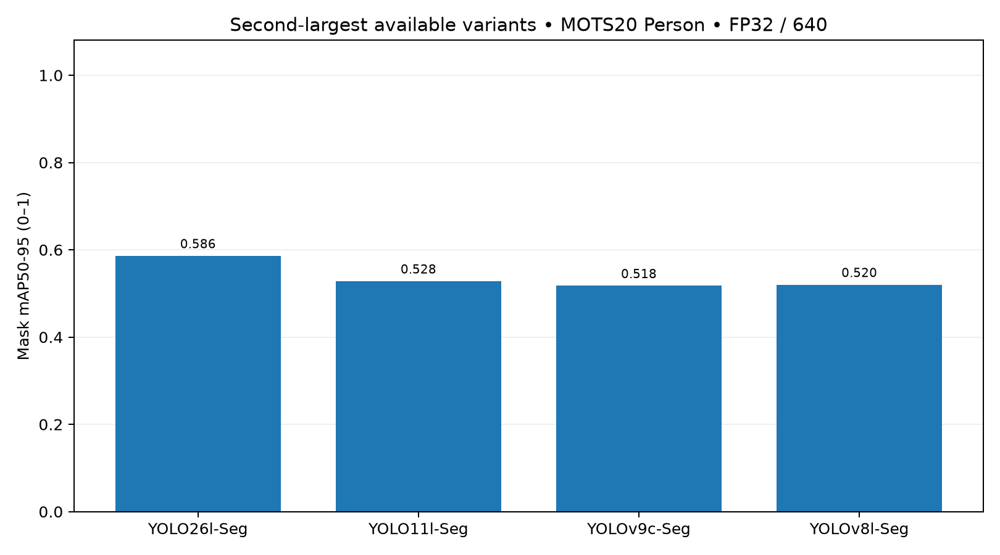

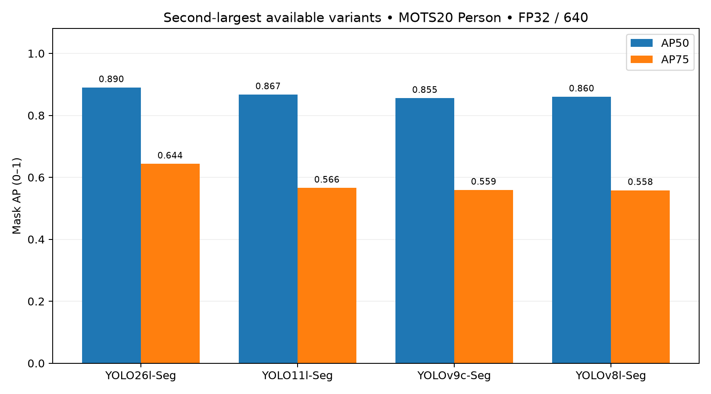

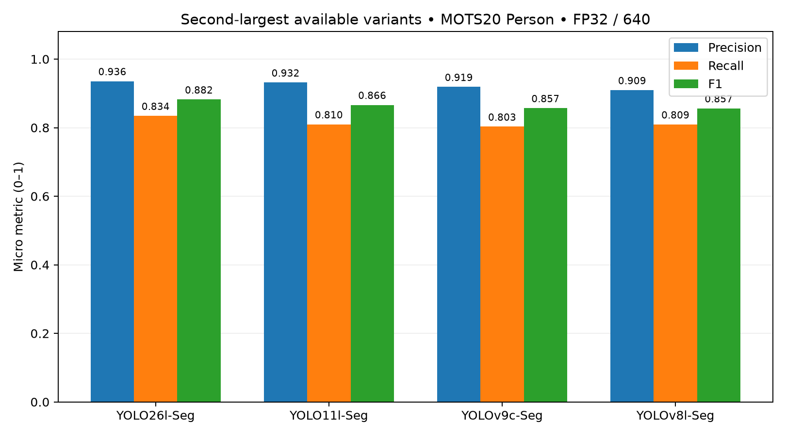

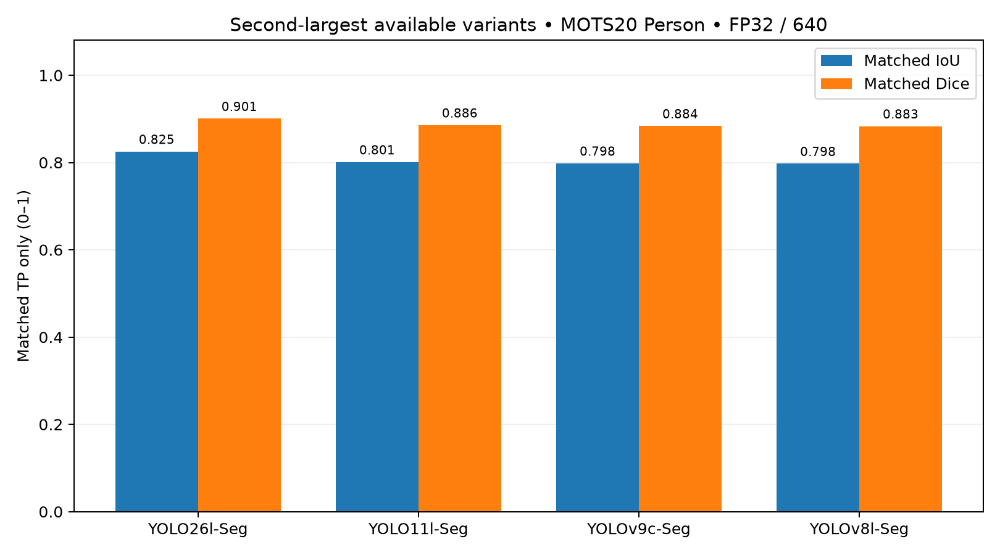

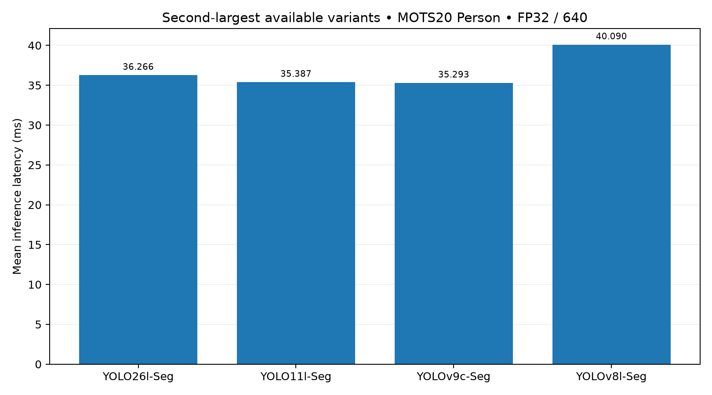

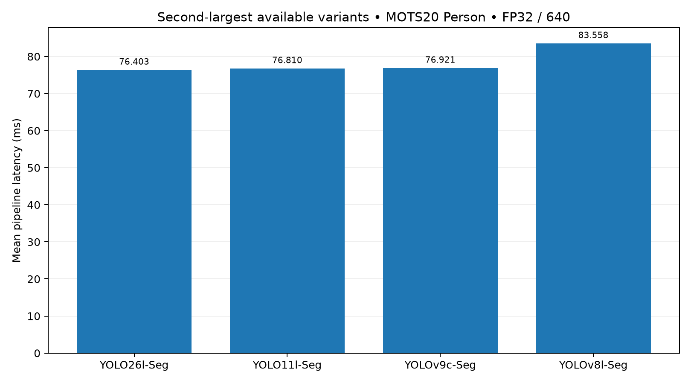

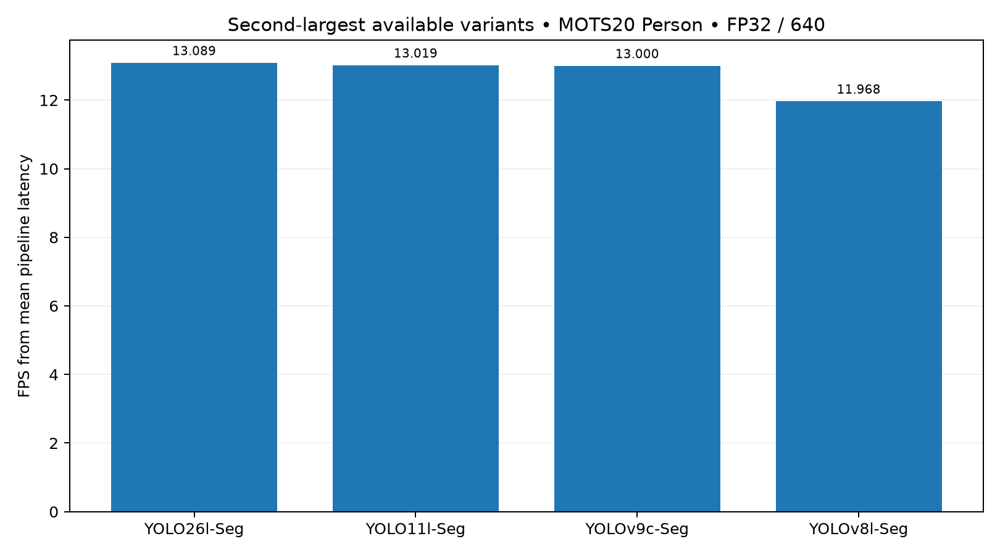

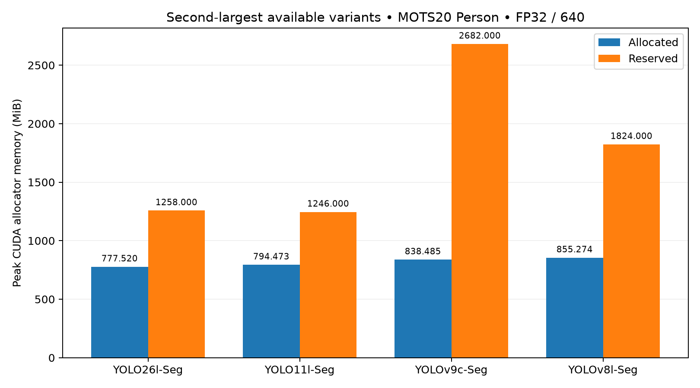

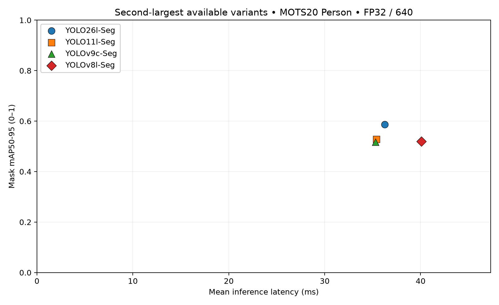

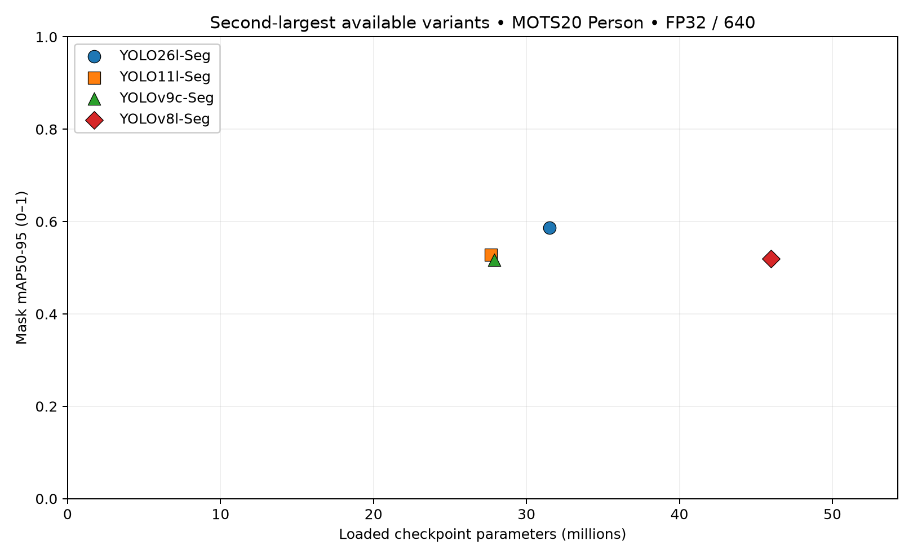

## 16. Warnings/failures
CPU NNPACK unsupported-hardware warnings appeared during model complexity inspection.
pycocotools emits a NumPy copy-keyword DeprecationWarning; all 15 pilot regression
tests passed. No dependencies were changed to suppress warnings. No OOM, failed
accuracy frames, resumed runs or contaminated primary timing runs occurred.
The execution sandbox initially failed its namespace initialization; benchmark
commands ran through the explicitly approved execution path. This does not change
inference settings. Stdout/stderr and failure records, if any, are retained.

## 17. Threats to validity
Second-largest variants have unequal capacity and training recipes: not architecture-only
or parameter-matched evidence. Native resolution and scene difficulty vary by
sequence, although each model sees identical inputs. Video frames are correlated;
no independent-image significance test is claimed. Person-only COCO-style AP with
the pilot's fixed ignore policy is not official MOTS tracking evaluation.
Fixed thresholds were not optimized by model. Preflight maxDet convergence is
sample-based, not proof of full-population cap convergence. Full candidate counts
are retained for later cap analysis. The same source frames in three speed rounds
improve repeatability but do not characterize every deployment workload. Shared
GPU telemetry cannot rule out every transient system effect. TP-only mask scores
exclude misses and must be interpreted with recall.

## 18. Interpretation
YOLO26l-Seg has the highest measured mask accuracy; YOLOv9c-Seg has the lowest mean neural inference latency; YOLO26l-Seg uses the lowest peak allocated memory. The empirical accuracy–inference-latency Pareto set is YOLO26l-Seg, YOLO11l-Seg, YOLOv9c-Seg. This is a descriptive trade-off, not a combined score or statistical superiority claim.

## 19. Conclusions
**A. Preliminary YOLO instance-segmentation comparison: YES**, within this exact
second-largest-variant, pretrained, MOTS20 Person frame-level protocol.
**B. Final CCTV robustness conclusions: NO.** No controlled blur, illumination,
camera-angle categories or explicit occlusion severity labels were tested.
Next: a separate preregistered CCTV robustness experiment; optionally a separate
capacity-controlled YOLO comparison to examine architecture effects.

Final protocol consistency checks:

| Item | PASS/FAIL | Evidence |
| --- | --- | --- |
| Frozen config/protocol | PASS | SHA256 at Phase 4 start versus final |
| Frozen implementation | PASS | Every benchmark/frozen-pilot Python source |
| Validated evaluator and pilot preserved | PASS | Original and frozen snapshot hashes |
| Image manifest unchanged | PASS | Ordered list, dimensions and original image hashes |
| Predetermined sample lists unchanged | PASS | Preflight/timing/visualization hashes frozen before full run |
| Dataset images unchanged | PASS | Rehash every one of 2,862 original image files |
| Ground truth and sequence metadata unchanged | PASS | All GT and seqinfo SHA256 |
| Checkpoints unchanged | PASS | All four checkpoint SHA256 |
| YOLO26l-Seg exact frame list/count | PASS | Successful metadata plus per-frame file audit |
| YOLO26l-Seg saved predictions and tensor shapes | PASS | Lossless RLE/class/score/dimensions checked on every saved frame |
| YOLO11l-Seg exact frame list/count | PASS | Successful metadata plus per-frame file audit |
| YOLO11l-Seg saved predictions and tensor shapes | PASS | Lossless RLE/class/score/dimensions checked on every saved frame |
| YOLOv8l-Seg exact frame list/count | PASS | Successful metadata plus per-frame file audit |
| YOLOv8l-Seg saved predictions and tensor shapes | PASS | Lossless RLE/class/score/dimensions checked on every saved frame |
| YOLOv9c-Seg exact frame list/count | PASS | Successful metadata plus per-frame file audit |
| YOLOv9c-Seg saved predictions and tensor shapes | PASS | Lossless RLE/class/score/dimensions checked on every saved frame |
| Common ap_max_dets | PASS | 200 |
| Common fixed_confidence | PASS | 0.25 |
| Common ap_confidence_floor | PASS | 0.001 |
| Common nms_iou | PASS | 0.7 |
| Common max_detections | PASS | 1000 |
| Common precision | PASS | fp32 |
| Common imgsz | PASS | 640 |
| Common batch | PASS | 1 |
| Common rect | PASS | False |
| Common retina_masks | PASS | True |
| Common matching_iou | PASS | 0.5 |
| Common ignore_prediction_ioa | PASS | 0.5 |
| NMS one-to-many path and CUDA FP32 | PASS | Backend state asserted at load |
| Same evaluator manifest | PASS | One source_manifest SHA256 |
| Same frozen protocol and config | PASS | Each model metadata |
| Three clean timing rounds per model | PASS | Contaminated rounds excluded from primary table |
| Same exact timing frame order for every round | PASS | 100 identical ordered frame keys × 12 runs |
| No contaminated timing in primary table | PASS | Before/during/after telemetry and other-process audit |
| Complete accuracy metrics | PASS | 4 overall plus 16 sequence records |
| Complete timing metrics | PASS | Dedicated timing, evaluator preparation excluded |

## 20. Exact artifact paths
All paths below are relative to workspace `YOLO_Second_Largest_Seg_MOTS20_Benchmark/`:

- Main report: `REPORT.md`; preserved summary: `reports/benchmark-20261001T0352Z/SUMMARY.md`
- Frozen protocol/config: `EXPERIMENT_PROTOCOL.md`, `configs/benchmark.yaml`
- Environment/data/checkpoint/source manifests: `manifests/`
- Exact all-frame list/hashes: `manifests/images.json`
- Predetermined frame lists: `manifests/{preflight,timing,visualization}_frames.json`
- Full-run freeze/order: `manifests/benchmark-20261001T0352Z_full_freeze.json`
- Comparison, per-sequence, preflight, consistency CSVs: `metrics/benchmark-20261001T0352Z/`
- Per-frame/matched-instance metrics: `metrics/benchmark-20261001T0352Z/{per_frame,per_instance}/`
- GT instance sizes/counts: `metrics/gt_instances.csv`, `metrics/gt_frames.csv`
- Lossless per-frame predictions/audits: `predictions/benchmark-20261001T0352Z/{preflight,accuracy}/`
- Timing measurements and telemetry: `timing/benchmark-20261001T0352Z/`
- Stdout/stderr and regression logs: `logs/benchmark-20261001T0352Z/`
- Plots, PDF copies and values: `outputs/plots/benchmark-20261001T0352Z/`
- Predetermined qualitative sheets: `outputs/visualizations/benchmark-20261001T0352Z/`

Model weights remain in workspace `models/`; dataset and pilot are unchanged.

## Cross-tier: largest vs second-largest

| Family | Largest model | Second-largest model | Largest mAP | Second mAP | Δ mAP (0–1) | Largest inference ms | Second inference ms | Δ latency ms | Largest VRAM MiB | Second VRAM MiB | Δ VRAM MiB |
| --- | --- | --- | --- | --- | --- | --- | --- | --- | --- | --- | --- |
| YOLO26 | YOLO26x-Seg | YOLO26l-Seg | 0.603730 | 0.586237 | -0.017493 | 72.458246 | 36.266080 | -36.192166 | 952.184082 | 777.520020 | -174.664062 |
| YOLO11 | YOLO11x-Seg | YOLO11l-Seg | 0.536674 | 0.528228 | -0.008446 | 69.406033 | 35.386769 | -34.019263 | 942.478027 | 794.472656 | -148.005371 |
| YOLOv8 | YOLOv8x-Seg | YOLOv8l-Seg | 0.524758 | 0.520145 | -0.004613 | 67.842816 | 40.089659 | -27.753157 | 1001.133301 | 855.274414 | -145.858887 |
| YOLOv9 | YOLOv9e-Seg | YOLOv9c-Seg | 0.536642 | 0.517646 | -0.018996 | 65.887918 | 35.292866 | -30.595051 | 855.407227 | 838.485352 | -16.921875 |

Absolute differences are second-largest minus largest. Percentage-point changes apply only to metrics on the 0–1 scale. Relative changes use the largest-model value as denominator. VRAM means peak allocated PyTorch memory, not whole-device usage.

| Family | Metric | Largest | Second-largest | Absolute Δ | Δ pp | Relative Δ % |
| --- | --- | --- | --- | --- | --- | --- |
| YOLO26 | map50_95 | 0.603730 | 0.586237 | -0.017493 | -1.749322 | -2.897524 |
| YOLO26 | ap50 | 0.903687 | 0.889890 | -0.013797 | -1.379691 | -1.526736 |
| YOLO26 | ap75 | 0.664426 | 0.643537 | -0.020889 | -2.088901 | -3.143918 |
| YOLO26 | recall | 0.846285 | 0.834387 | -0.011899 | -1.189856 | -1.405975 |
| YOLO26 | f1 | 0.893372 | 0.882145 | -0.011228 | -1.122750 | -1.256755 |
| YOLO26 | inference_ms | 72.458246 | 36.266080 | -36.192166 |  | -49.948996 |
| YOLO26 | pipeline_ms | 109.638635 | 76.402851 | -33.235783 |  | -30.313934 |
| YOLO26 | fps | 9.120872 | 13.088517 | 3.967644 |  | 43.500711 |
| YOLO26 | peak_allocated_mib | 952.184082 | 777.520020 | -174.664062 |  | -18.343518 |
| YOLO26 | parameters | 70693800.000000 | 31515528.000000 | -39178272.000000 |  | -55.419672 |
| YOLO26 | checkpoint_mb | 142.129861 | 63.700037 | -78.429824 |  | -55.181806 |
| YOLO11 | map50_95 | 0.536674 | 0.528228 | -0.008446 | -0.844575 | -1.573722 |
| YOLO11 | ap50 | 0.875806 | 0.867132 | -0.008674 | -0.867438 | -0.990445 |
| YOLO11 | ap75 | 0.575845 | 0.565728 | -0.010116 | -1.011617 | -1.756754 |
| YOLO11 | recall | 0.822228 | 0.809772 | -0.012456 | -1.245631 | -1.514946 |
| YOLO11 | f1 | 0.876613 | 0.866424 | -0.010189 | -1.018897 | -1.162311 |
| YOLO11 | inference_ms | 69.406033 | 35.386769 | -34.019263 |  | -49.014851 |
| YOLO11 | pipeline_ms | 105.885185 | 76.810370 | -29.074815 |  | -27.458813 |
| YOLO11 | fps | 9.444192 | 13.019075 | 3.574884 |  | 37.852721 |
| YOLO11 | peak_allocated_mib | 942.478027 | 794.472656 | -148.005371 |  | -15.703854 |
| YOLO11 | parameters | 62142656.000000 | 27678368.000000 | -34464288.000000 |  | -55.459953 |
| YOLO11 | checkpoint_mb | 125.090821 | 56.096965 | -68.993856 |  | -55.155011 |
| YOLOv8 | map50_95 | 0.524758 | 0.520145 | -0.004613 | -0.461346 | -0.879160 |
| YOLOv8 | ap50 | 0.866402 | 0.859978 | -0.006424 | -0.642441 | -0.741504 |
| YOLOv8 | ap75 | 0.560452 | 0.558149 | -0.002303 | -0.230316 | -0.410946 |
| YOLOv8 | recall | 0.814271 | 0.809400 | -0.004871 | -0.487097 | -0.598201 |
| YOLOv8 | f1 | 0.864616 | 0.856502 | -0.008114 | -0.811417 | -0.938471 |
| YOLOv8 | inference_ms | 67.842816 | 40.089659 | -27.753157 |  | -40.908026 |
| YOLOv8 | pipeline_ms | 109.441223 | 83.558328 | -25.882895 |  | -23.650042 |
| YOLOv8 | fps | 9.137325 | 11.967688 | 2.830363 |  | 30.975841 |
| YOLOv8 | peak_allocated_mib | 1001.133301 | 855.274414 | -145.858887 |  | -14.569377 |
| YOLOv8 | parameters | 71827888.000000 | 45997728.000000 | -25830160.000000 |  | -35.961185 |
| YOLOv8 | checkpoint_mb | 144.101612 | 92.417004 | -51.684608 |  | -35.866780 |
| YOLOv9 | map50_95 | 0.536642 | 0.517646 | -0.018996 | -1.899554 | -3.539704 |
| YOLOv9 | ap50 | 0.882037 | 0.855414 | -0.026623 | -2.662287 | -3.018340 |
| YOLOv9 | ap75 | 0.572100 | 0.559180 | -0.012920 | -1.292008 | -2.258361 |
| YOLOv9 | recall | 0.826578 | 0.802930 | -0.023648 | -2.364840 | -2.860999 |
| YOLOv9 | f1 | 0.877113 | 0.856956 | -0.020158 | -2.015761 | -2.298176 |
| YOLOv9 | inference_ms | 65.887918 | 35.292866 | -30.595051 |  | -46.434995 |
| YOLOv9 | pipeline_ms | 103.375589 | 76.920524 | -26.455065 |  | -25.591211 |
| YOLOv9 | fps | 9.673464 | 13.000431 | 3.326968 |  | 34.392726 |
| YOLOv9 | peak_allocated_mib | 855.407227 | 838.485352 | -16.921875 |  | -1.978224 |
| YOLOv9 | parameters | 60512800.000000 | 27897120.000000 | -32615680.000000 |  | -53.898811 |
| YOLOv9 | checkpoint_mb | 122.212466 | 56.470235 | -65.742231 |  | -53.793392 |

Accuracy ranking, largest: YOLO26x-Seg > YOLO11x-Seg > YOLOv9e-Seg > YOLOv8x-Seg.

Second-largest: YOLO26l-Seg > YOLO11l-Seg > YOLOv8l-Seg > YOLOv9c-Seg. These are descriptive rankings, not significance tests.

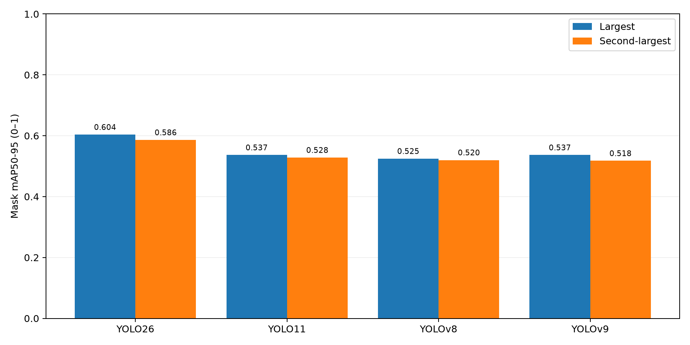

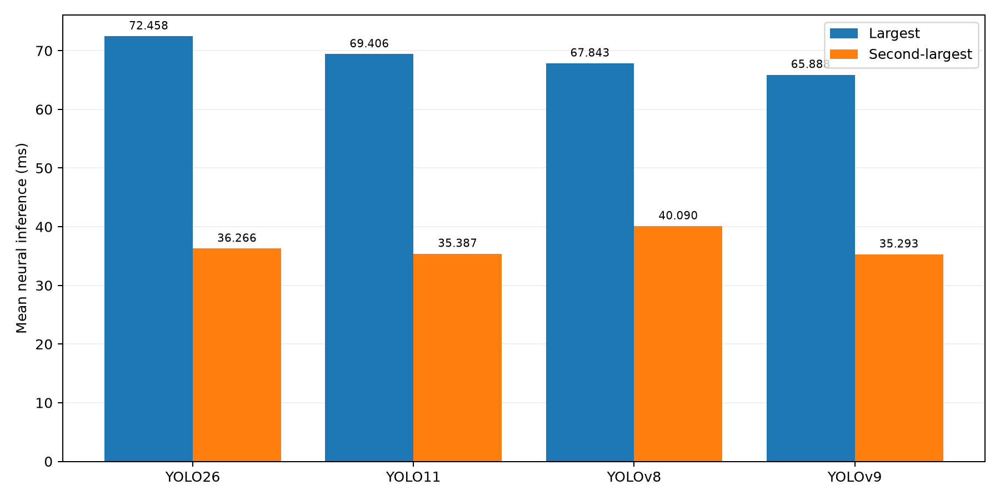

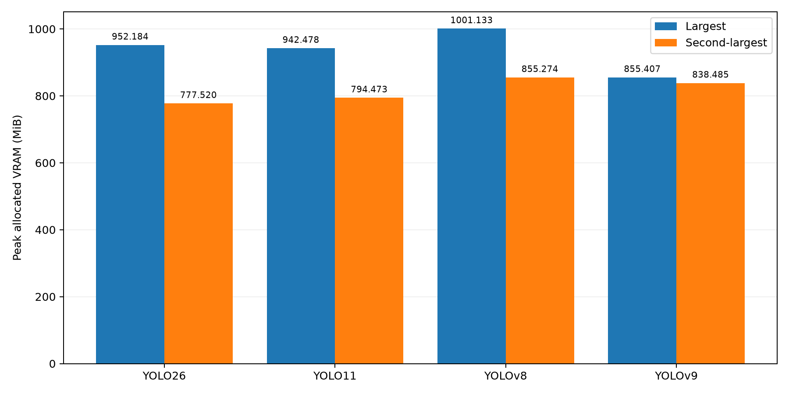

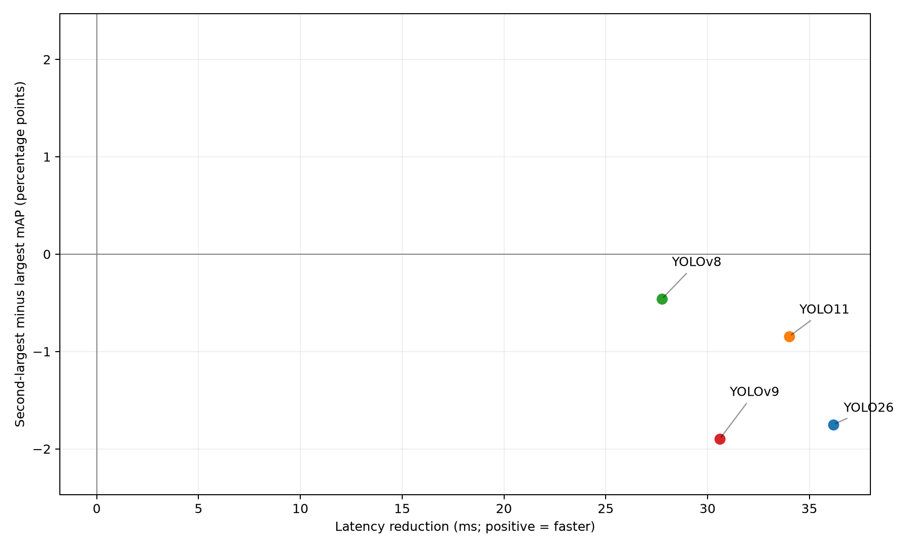

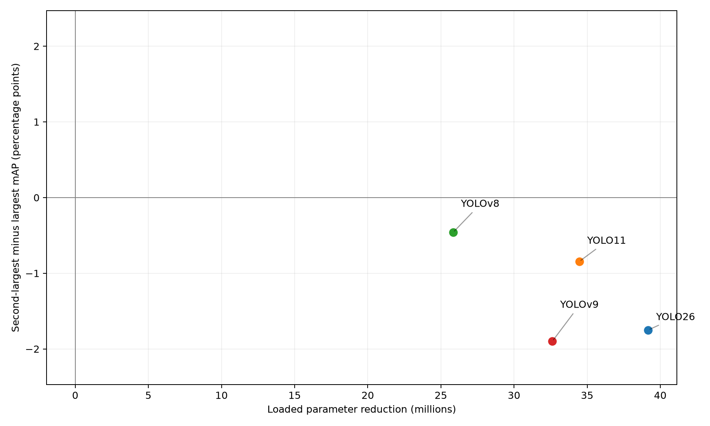

Experiment 1 asks “How do the largest available models compare?” Experiment 2 asks “How do the second-largest available models compare?” Together they begin to show scaling behavior. Neither establishes capacity-controlled architecture superiority, controlled blur, low-light, camera-angle, explicit occlusion-severity robustness or final CCTV deployment suitability.
